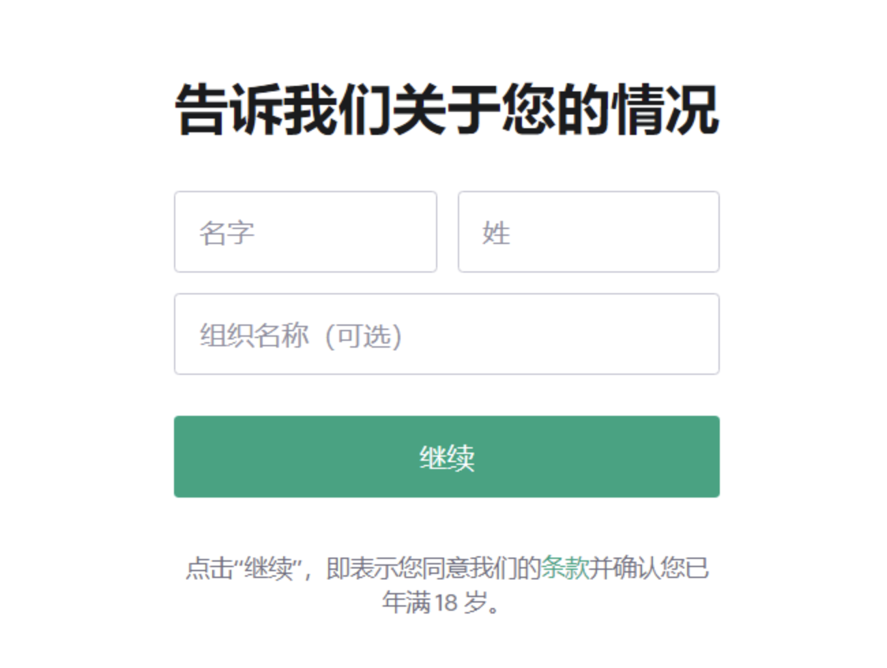

**GPT产品使用**

**GPT类产品有哪些？**

除了文心一言，阿里通义，其它几个产品都需要魔法才能够使用，所有产品都需要申请才能使用

如下是如何注册的方式，以及"**介绍一下Datawhale组织**"各个产品的回答

**ChatGPT**

网址：https://chat.openai.com/

如有账号直接"Log in"登录，如无账号点击"Sign up"。

创建自己的账号，当然也可以使用你已有的谷歌或微软账号

  ------------------------------------------------------------------- ------------------------------------------------------------------- ---------------------------------------------------------------------------------
  
  
  

  ------------------------------------------------------------------- ------------------------------------------------------------------- ---------------------------------------------------------------------------------

近期内注册会出现各种无法报错提示，别灰心，是发挥你的魔法的时候了。

  --------------------------------------------------------------------------------- ---------------------------------------------------------------------------------
  
  

  --------------------------------------------------------------------------------- ---------------------------------------------------------------------------------

下面是注册正常可用的图示：

  --------------------------------------------------------------------------------- ---------------------------------------------------------------------------------
  
  

--------------------------------------------------------------------------------- ---------------------------------------------------------------------------------

验证电话号码这一步又是验证你的魔法强度的时刻，加油！

中间跳过种种细节，看到这个画面，说明已经成功了。

接下来去往链接https://chat.openai.com/，登录（Log
in）即可开始ChatGPT之旅！

**测试：**

**文心一言**

网址：https://yiyan.baidu.com/

点击加入体验

再次点击"加入体验"，页面提示**"您已在等待体验中，加入成功将短信通知"**。

收到短信提醒后，再次登录https://yiyan.baidu.com/，发现"加入体验"变成了"开始体验"。开始你的"文心一言"之旅吧！

  ---------------------------------------------------------------------------------- ---------------------------------------------------------------------------------
  
  

  ---------------------------------------------------------------------------------- ---------------------------------------------------------------------------------

**测试：**

**New Bing：**

下载edge dev：https://www.microsoftedgeinsider.com/zh-cn/download/dev

在edge dev登录网址：https://www.bing.com/new

(注意，要先使用魔法，不然会跳转到国内版bing无法正常使用，如不能顺利跳转可以直接在网址添加代表其他国Bing的参数，比如https://www.bing.com/?mkt=ja-JP)

微软账号登录后，重新进入https://www.bing.com/new点击"聊天"，会发现已经加入候补名单。

  ---------------------------------------------------------------------------------- ---------------------------------------------------------------------------------- ----------------------------------------------------------------------------------
  
  
  

---------------------------------------------------------------------------------- ---------------------------------------------------------------------------------- ----------------------------------------------------------------------------------

审核通过后会你的微软注册会收到一封邮件，**在edge
dev中**再次进入https://www.bing.com/new即可愉快地开始聊天（注意如果你用的不是edge
dev浏览器，直接点击按钮跳转是无法正常使用的）。

  --------------------------------------------------------------------- -----------------------------------------------------------------------
  
  
 

  --------------------------------------------------------------------- -----------------------------------------------------------------------

**测试：**

欢迎大家提供其他大模型相关产品的使用方法！
