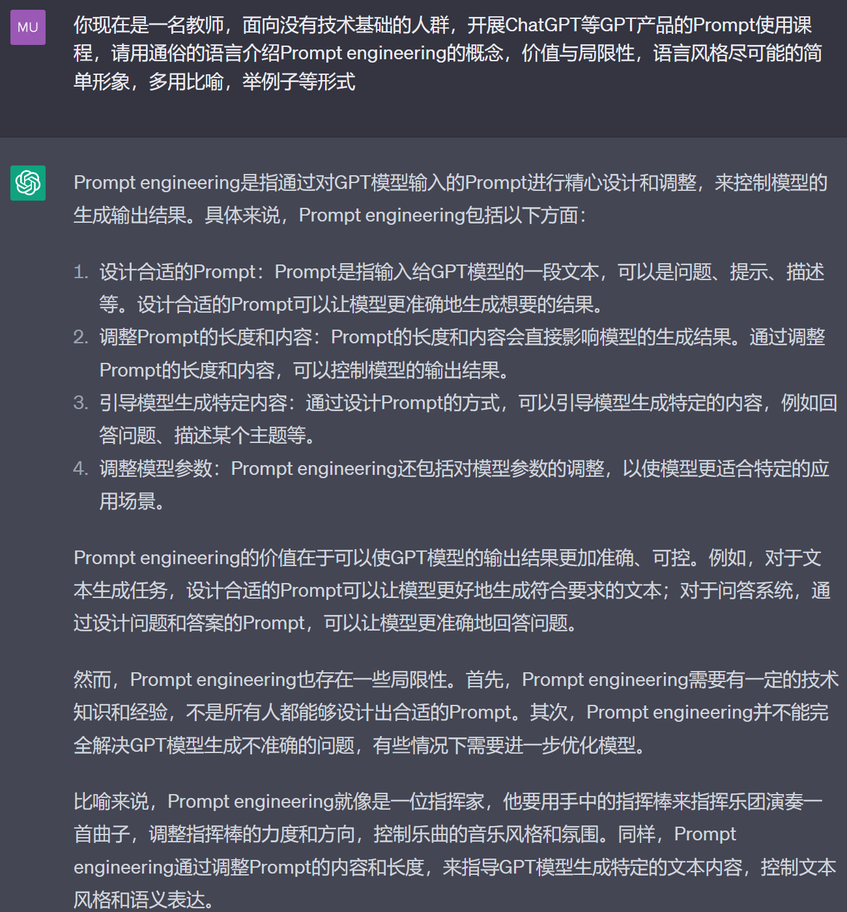

**（1）Prompt简介**

**什么是Prompt？**

prompt，简单的理解它是**给 AI 模型的指令**。

任何你希望解决的问题通过文字形式表达出来，作为Prompt传递给AI模型（在ChatGPT等GPT产品中目前是文字形式，未来可能有图像，语音，视频等多形式），AI
模型会基于 prompt 所提供的信息，生成对应的文本、图片甚至视频等信息。

比如，在 ChatGPT 里最下方的对话框**Send a message\...**
处，这里就是我们输入Prompt的位置，所输入的内容就是Prompt。

上方，Examples给出了一些案例，点击**Explain quantum computing in simple
terms**
，可以看到对话框里出现了相应的prompt，点击纸飞机的图标体验一下吧。

可以看到ChatGPT给我们返回了生成的文本。同时左边Chat会存储本次对话的记录，下次可以继续对话。

 
  
    -------------------------------------------------------------------------------- --------------------------------------------------------------------------------

比如，在文心一言中，最下方的对话框**请输入问题或\"/\"获取模板**
处，这里就是我们输入Prompt的位置，所输入的内容就是Prompt。

上方，给出了一些案例，点击**画一幅流光溢彩的漂流瓶**，可以看到对话框里出现了相应的prompt，点击右下角图标体验一下吧。

可以看到文心一言给我们返回了生成的图像，同时左边对话栏中会存储对话的记录。

  -------------------------------------------------------------------------------- --------------------------------------------------------------------------------
   
  
  -------------------------------------------------------------------------------- --------------------------------------------------------------------------------

**练一练**                                                         
在ChatGPT中**New chat**或文心一言中**新建对话**，基于你希望解决的问题，体验一下你的第一个Prompt                

**什么是Prompt Engineering？**

什么是Prompt Engineering？我们直接向ChatGPT提问**什么是Prompt
Engineering？**看看ChatGPT给出的答案

看起来有些专业，有很多NLP的术语，我们让它尽可能说人话，输出的内容更通俗一些，构建Prompt**请用通俗的语言介绍Prompt
engineering，语言风格尽可能的简单形象，多用比喻，举例子等形式**
，看看ChatGPT的反馈

看起来效果不错，简单理解Prompt
engineering就是给"聪明"的机器人如何下指令，为AI模型创建易于理解和操作的提示，以便模型更好地理解我们的意图，生成更准确的结果。

能不能让ChatGPT教我们如何学习Prompt engineering？构建如下的Prompt

**你现在是一名教师，面向没有技术基础的人群，开展ChatGPT等GPT产品的Prompt使用课程，请用通俗的语言介绍Prompt
engineering的概念，价值与局限性，语言风格尽可能的简单形象，多用比喻，举例子等形式**

可以看到生成了更精准的一些信息，比喻也很恰当，但要注意局限性

**Prompt
engineering**是指通过对GPT模型输入的Prompt进行精心设计和调整，来控制模型的生成输出结果。一般包含如下几个方面：

**设计合适的Prompt：**Prompt是指输入给GPT模型的一段文本，可以是问题、提示、描述等。设计合适的Prompt可以让模型更准确地生成想要的结果。

**调整Prompt的长度和内容：**Prompt的长度和内容会直接影响模型的生成结果。通过调整Prompt的长度和内容，可以控制模型的输出结果。

**引导模型生成特定内容：**通过设计Prompt的方式，可以引导模型生成特定的内容，例如回答问题、描述某个主题等。

**调整模型参数：**Prompt
engineering还包括对模型参数的调整，以使模型更适合特定的应用场景。

Prompt
engineering就像教你成为一位AI模型的指挥家，指挥家要用手中的指挥棒来指挥乐团演奏一首曲子，调整指挥棒的力度和方向，控制乐曲的音乐风格和氛围。而Prompt
engineering要指挥Prompt的内容和长度，来指导GPT模型生成特定的内容，控制风格和表达。

**Prompt Engineering的价值与局限性**

通过以上的内容，大家应该能感受到如何通过Prompt用好GPT生产力工具就是Prompt
Engineering的价值。

2023年2月份，OpenAI 的 CEO Sam
Altman表示，学会Prompt是个高杠杆技能。2023年3月份，李彦宏也表示十年后不会写提示词或被淘汰。香港的一些大学也尝试鼓励使用ChatGPT来支持学习。

  ------------------------------------------------------------------- ----------------------------------------------------------------------
  
  
  ------------------------------------------------------------------- ----------------------------------------------------------------------

不要焦虑，本教程就是教大家如何通过Prompt来使用GPT产品，在现阶段，学习Prompt可以让我们更好的使用GPT产品，更重要的是真正去了解，使用新的生产力工具。

随着科技进步与生产力工具的变化，Prompt必然会过时，或许会有更好的交互方式，但希望这个教程内容是一颗种子，帮助大家从认知和实践上尝试拥抱AIGC时代，无论未来有什么新的工具/产品，都可以心态上积极面对，以我为主为我所用，执行上有能力上手使用。

2022年9月， [Sam
Altman的访谈](https://greylock.com/greymatter/sam-altman-ai-for-the-next-era/)，5年内可能不需要PE，Prompt将被整合到任何地方

  -----------------------------------------------------------------------
  本文由@司玉鑫贡献，觉得不错在下方点个赞吧，更多建议欢迎评论

  -----------------------------------------------------------------------
