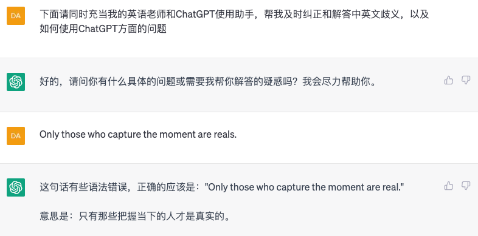

**基本提示模式**

  -----------------------------------------------------------------------
  感谢 **冯坤** 贡献！

  -----------------------------------------------------------------------

普通人使用ChatGPT重在磨练基本功，我下面提供的这套基本功如果你能融会贯通，对内容生产者们有着魔法级别的帮助，至少提升10倍的生产效率。

所谓ChatGPT的基本功核心是学会设置 Prompt ， Prompt
你可以理解成「提示语」，他的目的是让ChatGPT进入某种对话模式。

在ChatGPT中，prompt
通常指的是一个输入的文本段落或短语，作为生成模型输出的起点或引导。prompt
可以是一个问题、一段文字描述、一段对话或任何形式的文本输入，模型会基于
prompt 所提供的上下文和语义信息，生成相应的输出文本。

设置 prompt 就是设置你与ChatGPT的对话模式，以下我先罗列基本的提示模式

**1、解释**

这种模式下，你输入的内容是让ChatGPT对某个概念或理论进行解释和说明。他的主要作用是对各种概念做定义。

比如：

**2、类比**

这种模式下，你需要创造两种比喻或类比的对象或着结构，然后让ChatGPT进行概念的迁移。他的主要作用是让我们「以旧学新」，快速理解一些陌生领域的知识。

比如我延续第 1 种模式下，继续让ChatGPT对「设计模式」做具体的解释：

然后我让他类比到ChatGPT的使用中，用「罗列」提示让他罗列具体内容：

这样就完成了不同领域之间概念的交替，有利于让我们快速理解新领域的知识。

**3、罗列**

这种模式的目的你可以让ChatGPT遍历和列举事物的种类、各种属性和特点等。方便你更了解某类事物，主要价值有：提供灵感、补全认知盲区。

比如上面的第2点的罗列案例，再比如这样：

但你需要注意，他罗列的很多东西看似不重复，其实里面的一些东西本质还是重复的，所以这就涉及一个人的底层认知和思考能力，这个话题这里暂时不展开。

**4、转化**

这种提示模式里，你可让ChatGPT按照你想要的格式转化内容，有利于把混乱的内容整理成清晰的内容。

**案例1：转化为之前的类比概念呈现方式**

这个案例就是通过定义、类比以后转化方式。

**案例2：转化为markdown文本呈现格式**

**5、限制**

这种提示模式里，你可以限制ChatGPT不要输出某些东西，有利于他更清晰更准确的呈现内容。

**案例：限制年龄**

你还可以限制各种条件，比如让他必须用什么格式输出、比如让他必须用英文，比如让他不能出现XX或者只能出现XX，**案例2：**

**6、增改**

增改的意思是进行增加、删除、修改某些内容。这种提示模式下，你可以让他增加或者改正某些内容。本质是一种微调内容的方法。

**案例：增改markdown内容**

我在上面的第4点第2个案例里让ChatGPT把内容转化成markdown格式：

但是里面有些内容有错误，于是我让他进行增改：

你还可以对他继续操作，比如让他增加序号，或者增加具体模式的案例，都可以。

**7、对比**

这种提示模式下，你可以让ChatGPT比较两个或多个事物之间的相似性和差异性。有利于你分析问题，思考利弊。

**案例1：**

**案例2：**

**8、分类**

这种提示模式下，你可以让ChatGPT按照一定标准或特点对事物进行分类，价值是更好的分析事物和记忆。

**案例：**

**9、翻译**

翻译的其实也是转化的一种，只不过由于人类对语言了解需求过于庞大，我单独把他拿出来作为特定研究。

翻译就是让ChatGPT将不同的语言或术语进行翻译和转换，在上面的第4点转化中你已经见识过一些案例，我这里直接让他充当一个真正的语言翻译：

**10、推理**

这种提示模式下，你可以让ChatGPT观察和推断出未知的事实或逻辑关系，他的价值在于提供更完善的解决方案和灵感。

**案例：**

**11、归纳**

你可以把归纳理解成做复盘和总结，这种提示模式下ChatGPT可以从特定的例子或事实中归纳出一般规律或结论，可以让你看清楚一些事情的本质（也考验你的判断力）。

**案例：**

**12、模拟**

在这个提示模式下，你可以让ChatGPT模拟某个过程或现象。这个提示的价值是可以让你快速掌握某些技能。

**案例：**

**13、演员**

在这个提示模式下，你可以让ChatGPT充当各种角色。这个提示模式的价值是可以让你和他的对话更聚焦，更专业，提高获取信息的效率。

**案例：**

演员案例

如上的所有提示模式都可以互相组合利用，把他们两两组合或者三三组合会衍化出256种不同的使用方法，足够你应对大部分信息获取和利用需求。

还有一些其他的模式，我还在研究，后续继续补充。

既然说到这里，既然想要用好ChatGPT提升你10\~100倍的生产力，你必须深刻理解我在上面这篇文章中说的那些prompt模式，那么如何深刻理解呢？

最快的方法就2个：

看案例总结

直接用来下场做事

我这里直接给你做一个案例，是一篇关于《「2023年洗衣机购买指南」：如何省钱又选到好用的洗衣机？》的案例。

**第1步：**

**第2步：**

**第3步：**

**第4步：**

**第5步：**

**第6步：**

**第7步：**

**第8步：**

**第9步：**

**成品文章一览**

在如今快节奏的生活中，每个人都需要洗涤自己的衣物。洗衣机作为现代人生活中必不可少的家电，已经成为了大家洗衣的主要方式。

然而，随着市场上洗衣机品牌和型号的不断增多，人们在购买洗衣机时却面临着各种选择困难。一些消费者往往会陷入到选购的烦恼之中：应该选择哪种品牌？要选择多大的容量？选前置还是后置的？这些疑问不断地困扰着人们。

这些选择困难的根本原因是由于人们对洗衣机的了解不足。对于很多人来说，洗衣机只是一个简单的机器，它的作用就是帮助我们洗衣服。然而，洗衣机作为一个复杂的家电，它具有很多不同的特点和功能，而这些特点和功能的不同也是导致人们在选购时容易产生疑问和困惑的原因。

为了解决这些问题，我们推出了一款智能型洗衣机，该洗衣机不仅具有普通洗衣机的基本功能，还有许多独特的特点和功能，如省电、静音、智能程序等。通过这些功能，我们相信这款洗衣机将成为您家庭中必不可少的选择。我们也将提供详细的产品说明书和购买建议，以帮助消费者更好地了解这款洗衣机。

在选择洗衣机的时候，首先需要考虑自己的需求。如果您家庭成员较少，或者住的是小户型的公寓，那么一个容量较小、功能简单的洗衣机可能更加适合您的需求。而如果您有一大家子需要洗衣服，或者您需要处理一些比较复杂的衣物，那么容量更大、功能更全面的洗衣机则会更加实用。

除此之外，您还需要考虑自己的预算。洗衣机的价格有很大的差异，从几百元到上万元不等，您需要根据自己的预算选择合适的洗衣机。

另外，选择品牌也是很重要的一步。一些知名品牌的洗衣机通常拥有更好的质量和服务，但是价格也会相应地更高一些。如果您对价格比较敏感，也可以选择一些性价比较高的品牌。

总之，在选择洗衣机的时候，需要综合考虑自己的需求、预算和品牌等因素，选出最适合自己的洗衣机。

那么接下来我推荐一些综合性能不错的洗衣机：

海尔
EG10014HB19GU1：这款洗衣机拥有10公斤的洗涤容量，可轻松洗涤家庭的大型衣物。它采用变频技术，洗涤时噪音低、洗涤效果好，而且节能环保。此外，它还具有智能洗涤、蒸汽熨烫等多项功能，操作简便，非常适合家庭使用。

三星
WW60K42E00W/SC：这款洗衣机采用全自动控制系统，可实现全自动洗涤、脱水、烘干等多项功能。它的洗涤容量为6公斤，非常适合小型家庭使用。此外，它还配备了洗涤液自动投放系统、智能噪音控制等多项智能功能，让洗衣更加轻松方便。

小天鹅
TD90-M12603G：这款洗衣机采用了直驱电机技术，洗涤时噪音非常低。它的洗涤容量为9公斤，可满足大部分家庭的需求。此外，它还配备了空气洗涤、蒸汽护理等多项功能，让衣物更加洁净、舒适。

LG F2J6NN0W：这款洗衣机采用了6
motion直驱技术，可在多个方向上进行运动，提高洗涤效果。它的洗涤容量为8公斤，适合大部分家庭使用。此外，它还配备了多种智能功能，如直接驱动、蒸汽清洗等，让您的洗衣更加省心省力。

现在我们总结一下，对于不同的经济条件和用途，选择适合的洗衣机是非常重要的。如果您的经济条件比较紧张，可以选择一些价格较低、但基本功能齐全的洗衣机。这些洗衣机可能不具备太多智能功能，但是它们能够满足您基本的洗涤需求。

如果您的经济条件比较宽裕，可以选择一些价格较高、功能更加强大的洗衣机。这些洗衣机可能配备了更多的智能功能，如智能投放洗涤液、智能识别衣物类型等，使洗衣更加方便。同时，它们还可能拥有更大的洗涤容量和更高的洗涤效率，可以满足大家庭的需求。

此外，根据洗衣机的用途不同，选择的洗衣机也不同。例如，对于家庭中有小孩的家庭，可以选择配备蒸汽护理功能的洗衣机，可以更好地杀灭细菌、除螨，为家人提供更加健康的衣物。而对于长期使用空调或暖气的地区，可以选择配备空气洗涤功能的洗衣机，能够更好地清洁衣物和空气中的细菌和微粒。总之，根据不同的经济条件和用途选择适合的洗衣机是非常重要的，可以帮助您更加方便、舒适地进行洗衣。

如果您喜欢本文提供的洗衣机购买指南和推荐，可以关注我们的社交媒体账号【微信：组队学习】，我们将为您带来更多有价值的内容和实用的购物建议。同时，也欢迎您留言分享您的购买经验和心得，让更多人受益。
