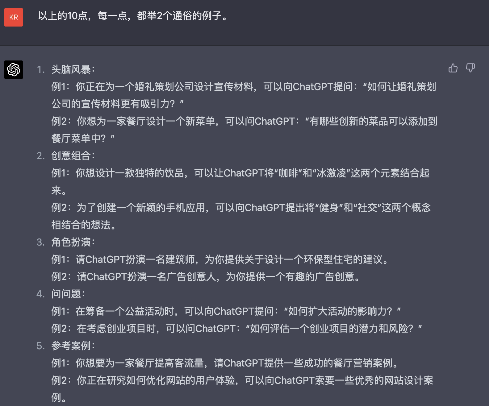
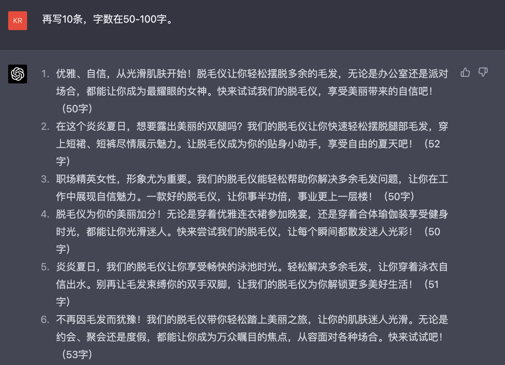
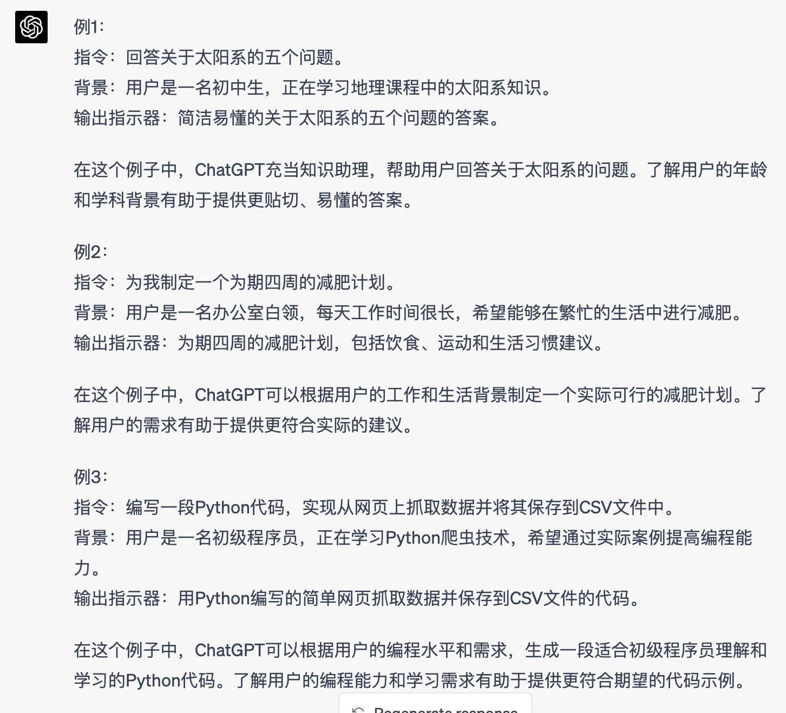

**基本用法简述**

  -----------------------------------------------------------------------
  感谢 **孟禹** 贡献！

  -----------------------------------------------------------------------

**目录**

**\[该类型的内容暂不支持下载\]**

**1、使用ChatGPT前要做的3个准备**

**1.1 认知上**

**1）超级学霸，几乎所有的工作/生活场景，都可以找它帮忙**

ChatGPT作为一个人工智能语言模型，具有强大的知识储备和处理能力。这意味着在许多工作和生活场景中，你都可以向它请教问题或寻求帮助。无论是科学、技术、艺术还是生活琐事，ChatGPT都有可能提供有用的建议和答案。

不过请注意，虽然ChatGPT非常强大，但它仍然是一个人工智能，不能替代专业人士在某些领域的专业意见，例如法律、医疗等。

**2）只有2021年9月及以前的数据，时效性可能会跟不上**

这意味着在时效性方面，无法提供最新的信息和动态。对于一些领域，特别是科技、政治和经济等快速变化的领域，ChatGPT可能无法提供最新的数据和见解。

**1.2 心态上**

1）拥抱ChatGPT，学会用它来为自己赋（gan）能（huo）；

2）它很强大，如果使用时觉得它有问题，很可能是自己没有掌握正确使用它的姿势。

**1.3 使用上**

1）前期使用它时整体效率会下降，但懂了它之后，效率会成倍提升；

2）四个要点：提示词 / 持续调教 / 角色扮演 / 英文环境。

**2、ChatGPT使用要点**

**2.1 提示词**

**1）清晰**

清晰的提示词能让 ChatGPT
更准确地理解用户的问题和需求，从而提供更精确的答案和建议。模糊或含糊不清的提示词可能导致AI理解错误或给出不相关的回答。

✅
正面例子：如何提高英语口语水平？（这个提示词明确表达了用户想了解的信息，即提高英语口语的方法。）

❌
反面例子：我怎么学英语啊？（这个提示词模糊，没有明确指出是要提高哪方面的英语能力，如听力、口语、阅读还是写作。）

**2）聚焦**

聚焦的提示词有助于ChatGPT快速定位用户的需求，从而提供更具针对性的回答。如果提示词包含多个问题或太过宽泛，AI可能无法全面解答，或给出过于笼统的回应。

✅
正面例子：哪些因素会影响房价？（这个提示词明确了关注点，即房价的影响因素。）

❌
反面例子：房子怎么样？（这个提示词过于宽泛，没有明确关注的方面，如房价、地理位置、建筑质量等。）

**3）相关**

相关的提示词能确保AI提供的信息和建议与用户的需求密切相关，提高用户满意度。不相关的提示词可能导致ChatGPT给出与用户需求无关的回答，浪费时间和资源。

✅
正面例子：如何有效管理时间？（这个提示词与提高时间管理能力密切相关，有助于获得实用的建议。）

❌
反面例子：我今天好累，怎么办？（这个提示词与实际问题关联不大，可能导致AI给出与用户需求无关的回答。）

**2.2 持续调教**

ChatGPT支持多轮对话，且它会基于历史对话来消化我们的问题。所以为了更好地获得需要的答案，我们可以结合提问的原则，问它、问它、再问它。

就像是与一个朋友聊天，如果ChatGPT没听清楚或者没理解我们的问题，可以再问一遍，换个说法，直到他明白我们的意思。

-----------------------------------------------------------------------

举个例子：假设我们想问ChatGPT关于烘焙蛋糕的问题。 
第一次提问：怎么做蛋糕？
（这个问题太宽泛，ChatGPT可能给出一个简单的回答。） 
第二次提问：怎么做戚风蛋糕？
（这次问题更具体了，但仍可能需要更多信息。）
第三次提问：我想在家制作戚风蛋糕，请告诉我所需的材料和步骤。
（这个问题明确了需求，ChatGPT现在可以提供更详细的答案。）          
案例：如何提问ChatGPT「如何持续调教ChatGPT？」

-----------------------------------------------------------------------

[如何持续调教ChatGPT？](https://wsbj757q14.feishu.cn/docx/TUq1dGevNo4mQ4x1tjzc1Nlpnhh)

**2.3 角色扮演**

角色扮演有助于为ChatGPT提供更明确的上下文和指引，从而使其更容易理解我们的问题和需求。

当我们以特定角色来提问时，ChatGPT会根据这个角色的知识和经验来回答问题。这有助于生成更专业、更具针对性的回答。

-----------------------------------------------------------------------

如果我们想了解关于摄影技巧的建议，可以将问题提给一个虚拟的摄影师角色，如： "你是一名专业摄影师，请告诉我如何拍出更好的肖像照片。" 这样的提问可以让ChatGPT更好地理解我们的需求，并提供更专业的答案。

-----------------------------------------------------------------------

ChatGPT-提示词网站（里面有各种角色的提示词，可学习模仿）

https://ai.newzone.top/

https://www.explainthis.io/zh-hans/chatgpt

**2.4 英文环境**

由于ChatGPT的训练数据英文内容比中文内容更加丰富，所以在英文场景下，ChatGPT通常能够更好地理解上下文和提供准确的回答。

-----------------------------------------------------------------------

中文和英文相比，主要有以下不足之处：
训练数据：如前所述，ChatGPT的训练数据中英文内容更丰富。因此，在中文场景下，它可能在某些问题上表现不如英文场景。语言结构差异：中文和英文的语言结构有很大差异。中                      文是一种以字符为基本单位的语言，而英文是一种以词为基本单位的语言。这使得在中文场景下，处理词汇、语法和句子结构等方面的问题变得更加复杂。
语境理解：由于中文中存在许多隐含的语境和表达方式，这可能会让ChatGPT在 理解和回答问题时遇到困难。相比之下，英文往往在表达时更加直接和明确。

-----------------------------------------------------------------------

**小结**

演示：【如何更好地使用ChatGPT？】

ChatGPT的魅力在于可以持续对话，与搜索引擎不一样的是，它并不需要你有多高超的提问能力，只要你在它给完答案之后，把你对它给到的答案的反馈给到它，并继续向它提问。

**3、个人可以怎么使用ChatGPT？**

**3.1 问答助理**

**3.1.1 深入研究某个知识板块**

提示词：（有啥问题直接问就好，问题要清晰、聚焦、相关），问完之后继续有针对性地提问。

**3.1.2 信息搜集**

提示词：有哪些 / 哪几个；继续。

**3.1.3 咨询教练**

法律咨询 / 心理咨询 / 健身咨询\...

提示词：你是一名法律专家（心理咨询师 /
企业咨询师\...），我遇到的问题是：xxx

可以先让ChatGPT描述【xx咨询教练】的特点，然后调教它，强化它对这一特点的理解。在此基础上，开始进行咨询。

**3.2 创作（写作/短视频等）**

**3.2.1 灵感激发**

提示词：可参考下图。

**3.2.2 素材寻找（金句/案例）**

提示词：帮我找一个xxx的案例，要求是：xxx、xxx。

**3.2.3 语言润色**

提示词：把上面这段文字润色一下，要求：xxx。

**3.2.4 文案（or 脚本）撰写**

提示词：你是一个文案大师，你现在需要撰写xxx的宣传文案，面向用户的特点是：xxx，文案的要求是：xxx。请写出10个xxx的宣传文案。

**3.2.5 标题优化**

提示词：把这个标题润色一下，要求：xxx。

**3.3 写代码 & 改BUG**

通过与ChatGPT4的持续对话，可以完成基于某个目标的代码程序，且程序可以运行。提示词：使用Python（编程语言）做xx事，并附上代码。

注释：

ChatGPT-4写出来的代码效果更好，3.5写出来的代码运行效果较差。同时，GPT-4第一次写出来的代码很可能会报错，把报错信息返回给GTP-4，它会根据报错信息重新生成。来回调整几轮，就可以得到可运行的目标代码啦。

不一定要懂某种编程语言，比如Python，但需要懂流程化的处理思路，告诉ChatGPT明确的指令。

**4、文本生成AI提示词高阶玩法**

**Instruction（必须）：** 指令，即你希望模型执行的具体任务。

**Context（选填）：**
背景信息，或者说是上下文信息，这可以引导模型做出更好的反应。

**Input Data（选填）：** 输入数据，告知模型需要处理的数据。

**Output Indicator（选填）：**
输出指示器，告知模型我们要输出的类型或格式。

（来源：Elavis Saravia总结）

**5、一些基于ChatGPT的拓展**

**5.1 ChatGPT + PDF（ChatDOC）**

https://chatdoc.com/chatdoc/

可以导入PDF文档，基于PDF进行有目的性地学习。对于我这种英文读起来比较慢的人，读英文材料会轻松很多。

**5.2 ChatGPT + Excel**

可以让ChatGPT写VBA，然后嵌入到Excel中运行，感兴趣的小伙伴可以自行探索一下。

**5.3 ChatGPT + 用户评价（卖货公司需要。。）**

把自己公司（消费品牌公司）的商品评价数据全部通过API接口喂进ChatGPT，然后让ChatGPT给出正负向评价打标。

**5.4 ChatGPT + 私董会**

告诉ChatGPT要开一个私董会，私董会的人选有：乔布斯、马斯克等，然后把自己的问题放进去，让ChatGPT站在几个名人的角度给建议和策略。

（来源：梨儿长大）

**5.5 ChatGPT 生成思维导图**

让ChatGPT 生成某本书/某篇文档的思维导图，

1）给chatgpt下指令说用markdown格式输出某一主题的内容

​2）内容到你满意后，复制到txt里，再把txt的扩展名该成md

​3）打开xmind，随便新建一个导图，点击文件---导入markdown格式，选择刚才保存的txt即可

**5.6 ChatGPT 生成流程图**

https://mp.weixin.qq.com/s/GXXh0jOdpAIv1QDc8DM5zA

**5.7 喂给ChatGPT某个特定主题/大牛的资料**

需要研究某个领域的学习内容，就把相关的资料全部喂给它，然后让ChatGPT基于资料生成回答。

**5.8 ChatGPT + SQL**

可以使用ChatGPT写SQL语句，优化SQL性能等。

**\[该类型的内容暂不支持下载\]**

**5.9 导出ChatGPT对话记录的插件**

ChatGPT to Markdown / ChatGPT Save Data ：谷歌应用商店下载

**6、一些很棒的关于ChatGPT使用的资料**

**点击图片可查看完整表格**