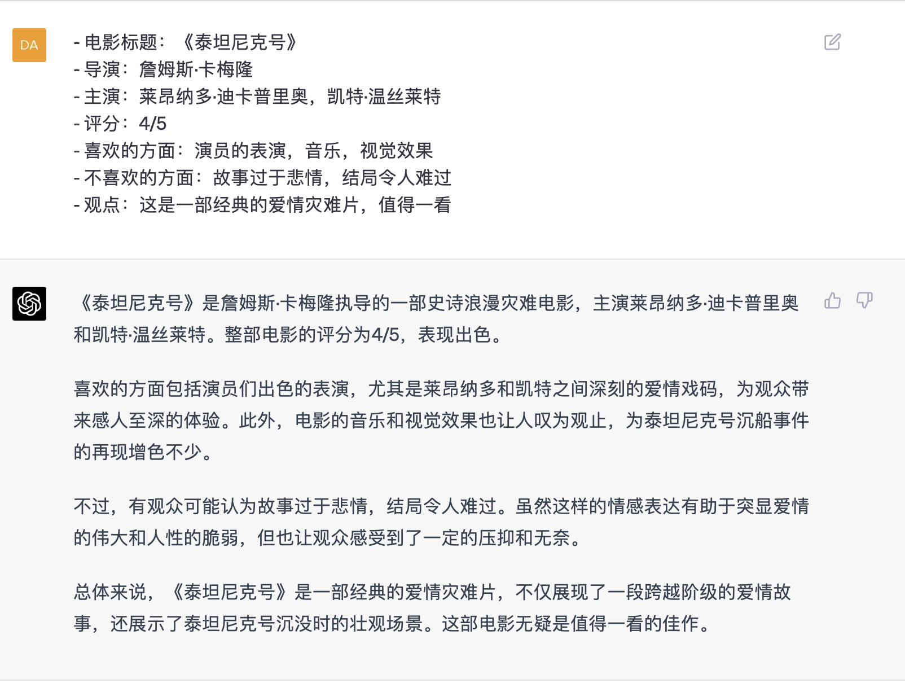
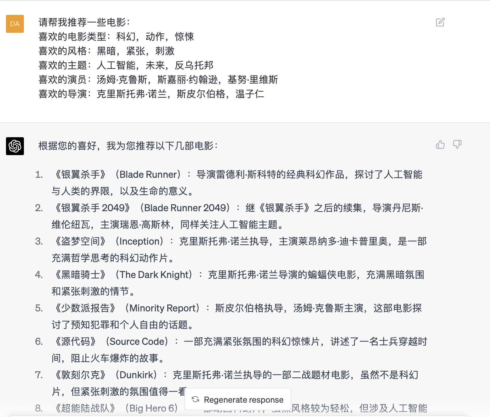
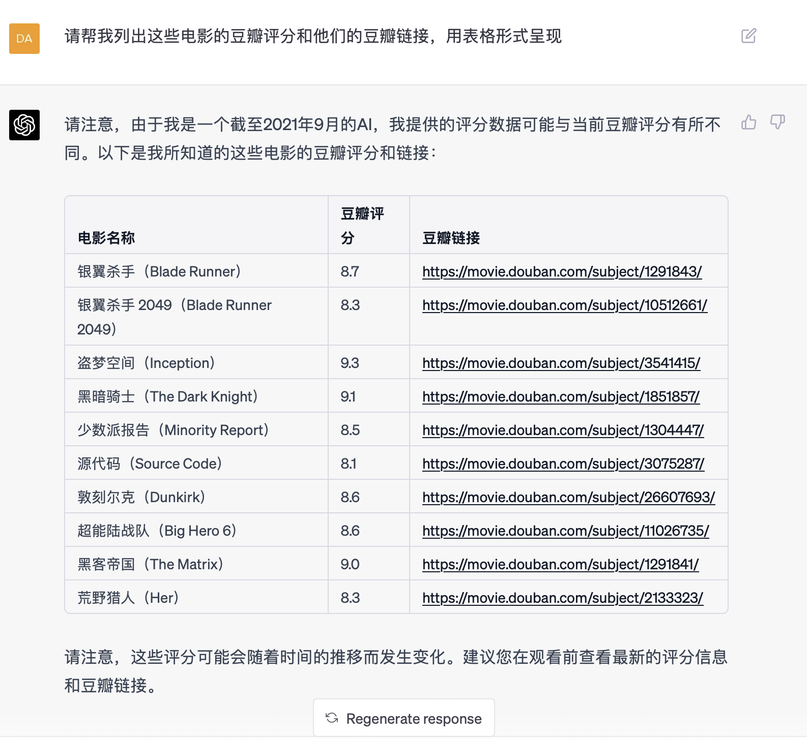
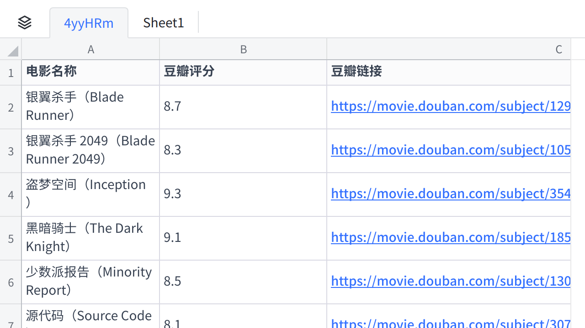

**小心踩坑（案例）**

书评 / 影评
就比较简单了，直接上小学作文万能公式就行：时间、地点、人物、起因、经过、结果。可以添加自己希望总结的内容，比如中心思想、书的意义等等

  ------------------------------------------------------------------------
  请介绍一下阿西莫夫的书《I，robot》，我希望有以下内容：时间、地点、人物、起因、经过、结果、启示意义

-----------------------------------------------------------------------
  
《I, Robot》是科幻作家艾萨克·阿西莫夫所著的一部短篇小说集，于1950年 首次出版。这本书在科幻文学史上有着重要的地位，因为它首次明确提出了阿西莫夫所著名的"三大法则"，成为了后来很多科幻小说中机器人主题的基础。时间：小说集中的故事跨越了2035年到2057年的时期。                      地点：大部分故事发生在未来地球上的城市和机器人制造厂。
人物：主要人物包括机器人学家苏珊·卡利文、机器人心理学家阿尔弗雷德·利斯通、以及一些机器人和人类角色。 
起因：在未来的世界里，机器人被广泛使用，但机器人的意识和情感可能会对人类构成威胁。因此，机器人心理学家阿尔弗雷德·利斯通开始研究开发"三大法则"，以确保机器人的行为符合人类利益。
经过：每个故事都是独立的，讲述了一个或多个机器人如何运用"三大法则"与人类互动的故事。这些故事探讨了机器人的智能、情感和自我意识，以及机器人与人类之间的关系和冲突。
结果：每个故事都有不同的结局，有些是机器人与人类和平共处的故事，有些则涉及机器人发生故障或违反"三大法则"的事件。
启示意义：《I,Robot》探讨了机器人智能、人工智能、道德和伦理等主题，以及人类与机器人之间的关系。书中"三大法则"对于机器人研究和开发有着深远的影响，成为了机器人学领域的重要理论基础。此外，本书也引发了人们对于人工智能和机器人道德的讨论和反思，对未来科技的发展和人类社会的进步有着重要的启示作用。 

-----------------------------------------------------------------------

  -----------------------------------------------------------------------
  小心有坑

  -----------------------------------------------------------------------

千万不要全信chatgpt，他的确有可能一本正经地胡说八道。

**案例：推荐电影**

当我让chatgpt为我推荐一些电影，看上去一切正常

但我并不知道这些电影到底好不好看，于是我希望它帮我列出豆瓣评分以及豆瓣链接。问题来了。

粗一看没问题，我把表格信息拷贝下来，大家在顺手一搜或者点击链接试试，就知道它在一本正经地胡说八道。

**点击图片可查看完整电子表格**

【划重点💡】chatgpt擅长处理加工已有内容，生成新的内容，但是不善于直接给出准确的"信息"。

当他提供精确信息的时候，一定要核实！

  ------------------------------------------------------------------------------------------------------------------------------------
  作业(选做)：请提交你使用chatgpt过程中遇到的胡说八道的问题，以及你有什么解决问题的好方法吗？我们将评选**有趣的"chatgpt犯的错误"。**

  ------------------------------------------------------------------------------------------------------------------------------------
