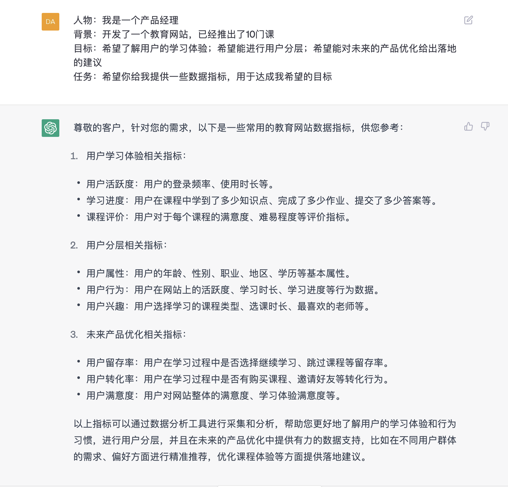

**持续调教prompt(案例)**

想象你在指导小孩子功课，让他交给你一份课后作业，你会怎么和他说话？

  -----------------------------------------------------------------------
  "今天作业呢，给我拿过来检查！"

  -----------------------------------------------------------------------

你在请领导给你一份资料，你又会怎么说话？

  -----------------------------------------------------------------------
  "李总，您能不能把昨天您提到的那份资料发给我借鉴一下？"

  -----------------------------------------------------------------------

虽然你是同一个人，但是说话的语气、方式是不是完全不一样？

好了，现在李总说他昨天开了好多会，已经不记得提到的资料是哪一份了，你需要详细描述一下。

  -----------------------------------------------------------------------------------------
  "就是您在下午的产品部门会议上提到的那份使用Chatgpt来搭建产品框架的资料，好像是个视频。"

  -----------------------------------------------------------------------------------------

假设李总是chatgpt，他有无数多的资料，他不知道你希望是哪一个，于是你需要把你的需求清晰描述给它，你的需求越清晰，他给你的材料也越准确。

现在我们来找一个案例，试一下如何持续调教以得到一个好结果的全过程，并且尝试能否提炼出提问的万能公式来。

**案例：旅游小助手**

**第一次提问：**

  -----------------------------------------------------------------------
  我要去杭州玩，给我个旅游攻略

  -----------------------------------------------------------------------

**ChatGPT结果：**

答案已经很详细了，但是这些用小红书查一下好像也差不多。而且我就是五一期间想要去杭州玩，他说避免五一高峰期，这不是没达到目的么。

**第二次提问：**

时间：五一期间                                                       
地点：杭州                                                           
人物：一家三口                                                 
背景：从上海出发自驾游，4月30日晚出发，在杭州住两天，5月3日返回 
目标：希望避开人流高峰，去一些小众但是有当地文化特色的地方 
角色：你是一个杭州旅行社的导游，推荐给我一份适合以上要求的旅行计划 

**ChatGPT结果：**

  ------------------------------------------------------------------------------------ ------------------------------------------------------------------------------------
  
    ------------------------------------------------------------------------------------ ------------------------------------------------------------------------------------

去过杭州的人知道这个攻略还是很有问题的，五一节去灵隐寺不堵上仨钟头都不好意思说自己去过灵隐寺，完全没有"避开人流高峰"。

【划重点💡】Chatgpt会选择性忽略包含时间性的讯息。

假设我不了解杭州当地情况，我不确定这份攻略是否靠谱，可以继续咨询。

**第三次提问：**

  -----------------------------------------------------------------------
  你的这条线路适合自驾吗？各个地点之间的距离大概多远，需要开多久的车

  -----------------------------------------------------------------------

**ChatGPT结果：**

哪怕没去过杭州，我也觉得不太靠谱：

路上要花费大量的时间，加上可能的堵车，不知道具体要多少时间。

这些景区不知道到底是否符合我的喜好，需要细化我的需求。

再次优化一下。

**第四次提问：**

  ---------------------------------------------------------------------------------
  时间：五一期间\
  地点：杭州\
  人物：一家三口，喜好人文古迹，不喜欢游乐园之类人造景点，可以接受登山等步行活动\
  背景：从上海出发自驾游，4月30日晚出发，在杭州住两天，5月3日返回\
  目标：希望避开人多的地方；旅游线路的总路程最短，车程时间最少。\
  角色：你是一个杭州旅行社的导游，推荐给我一份适合以上要求的旅行计划

  ---------------------------------------------------------------------------------

**ChatGPT结果：**

我还是不放心，希望它能把数据列上。

**第五次提问：**

  -----------------------------------------------------------------------
  以上信息加上景点间距离和路上花费时间

  -----------------------------------------------------------------------

**ChatGPT结果：**

基本满意了～

总结一下，给一份合格的prompt，其实和小学写作文是差不多，使用同样的四要素：时间、地点、人物、事情。

作文是用来描述，所以"事情"可以拆分为起因、经过，结果。

而我们是给Chatgpt提要求，答案是未知的，那么"事情"可以拆分为背景、目标、任务（是不是和写方案设计差不多）

【划重点💡】因此，记住这个基本公式，可以保证chatgpt给出基本合格的答案。

**时间**

**地点**

**人物**

**背景**

**目标**

**任务**

在不同的场景中，某些要素可以省略，例如我现在是一个产品经理，希望ChatGPT给我罗列一些描述用户体验的数据，就可以省略时间和地点：

**提问：**

人物：我是一个产品经理 
背景：开发了一个教育网站，已经推出了10门课
目标：希望了解用户的学习体验；希望能进行用户分层；希望能对未来的产品优化给出落地的建议        任务：希望你给我提供一些数据指标，用于达成我希望的目标
**ChatGPT结果：**

还是挺靠谱的。

所以，一定要知道自己想问什么，套用**基本公式**（网上也有很多，原理都类似），就能大致拿到你想要的结果。

【课后小福利🌹】完成作业，即可领取XXXXX

*（待定，技术是否可以实现）*
