**ChatGPT辅助数学理论和公式推导**

  -----------------------------------------------------------------------
  感谢 **王茂霖** 贡献！

  -----------------------------------------------------------------------

**一、背景说明**

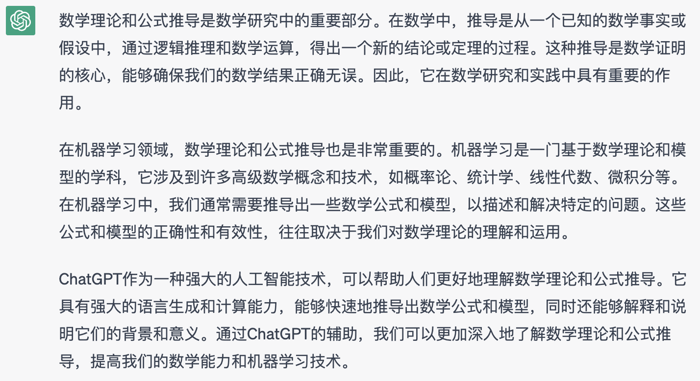
------By: ChatGPT

**二、示例**

**2.1 概念解释**

**示例1: 解释数学相关的概念**

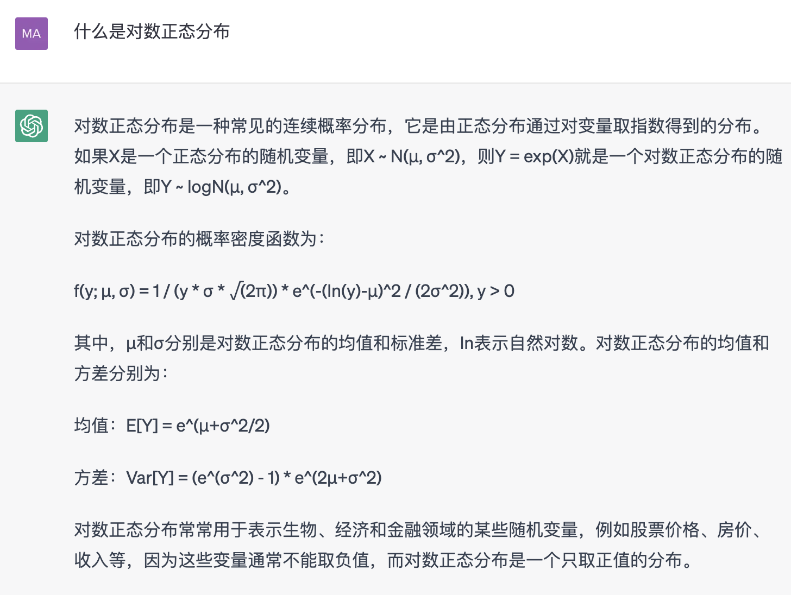
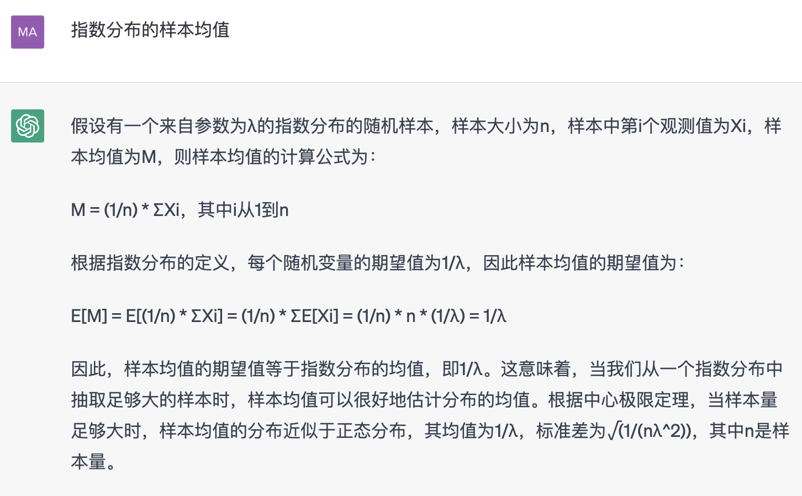
**2.2 公式推导**

  ------------------------------------------------------------------------------------------------------------------------------------------------------------------------------------------------------------------------------------------------------------------------------------------------
  Tip:
  这块是个人觉得ChatGPT很惊艳的一块，因为数学问题相对于语言来说，往往是更为困难的，但ChatGPT能给出一部分正确的推导思路，可以辅助相关的证明推导。但需要说明的是，在向ChatGPT提相关问题的时候最好能给出多的相关数学背景信息，包括一些公式和名词说明，另外就是ChatGPT生成的推导结果往往是有问题的，
  请大家仔细甄别。

  ------------------------------------------------------------------------------------------------------------------------------------------------------------------------------------------------------------------------------------------------------------------------------------------------

**示例1: 提问函数的积分结果**

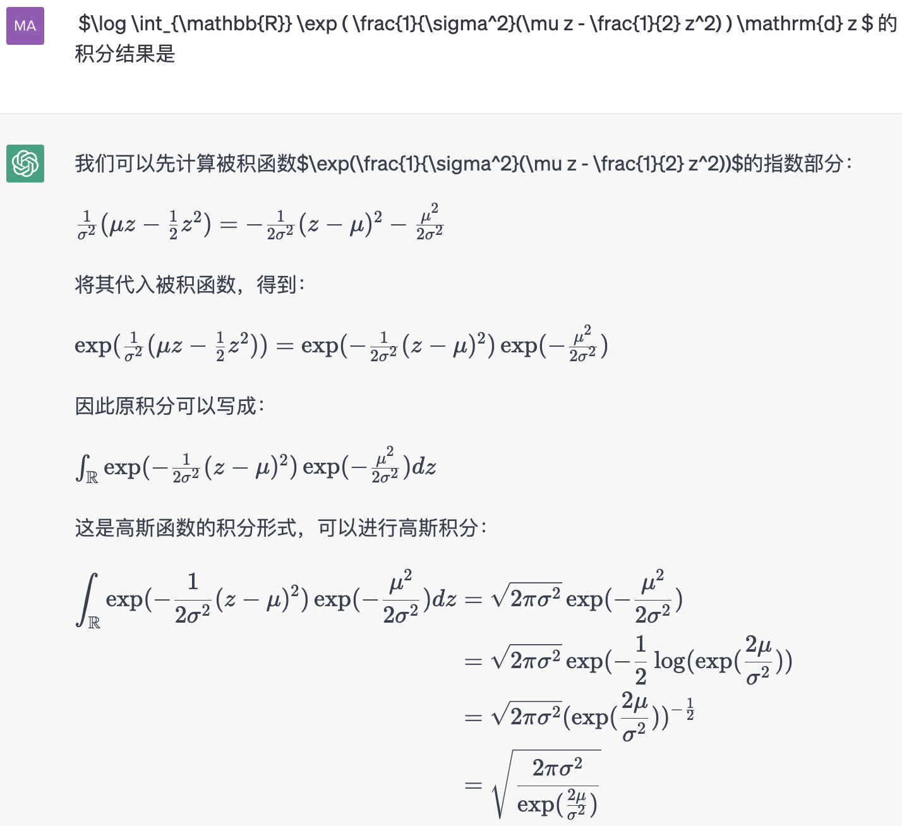
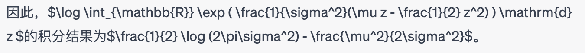
备注：\$\\log \\int\_{\\mathbb{R}} \\exp ( \\frac{1}{\\sigma\^2}(\\mu
z - \\frac{1}{2} z\^2) ) \\mathrm{d} z\$
代表公式$\log\int_{\mathbb{R}}^{}{}\exp\left( \frac{1}{\sigma^{2}}\left( \mu z - \frac{1}{2}z^{2} \right) \right)dz$

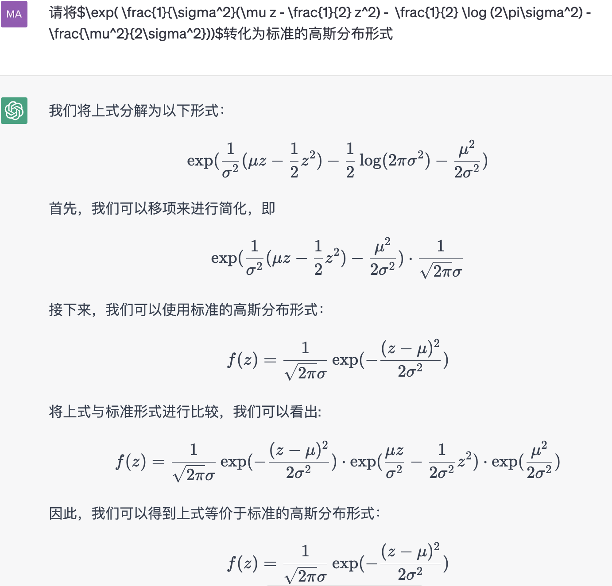
**示例2: 证明一些理论（题来自：《统计学习方法（第一版）》 习题 1.2）**

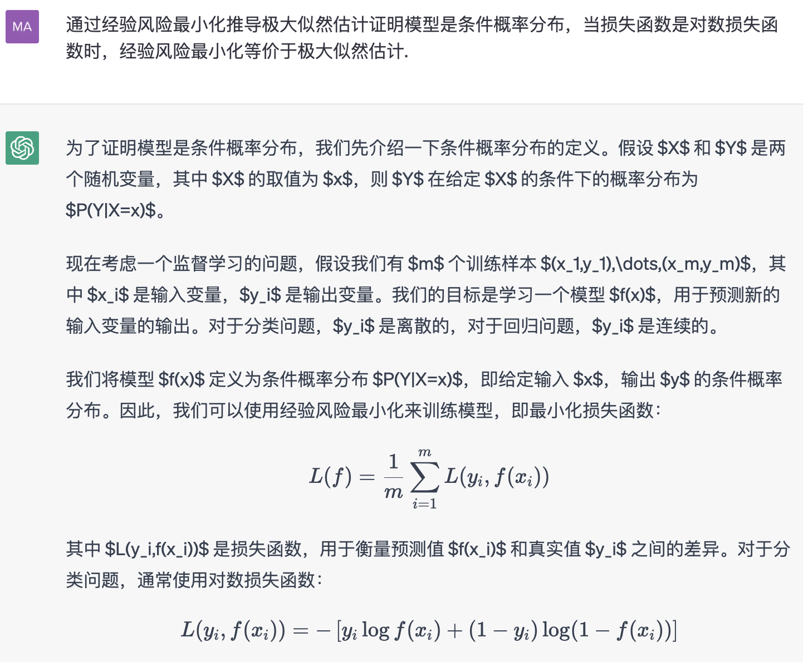
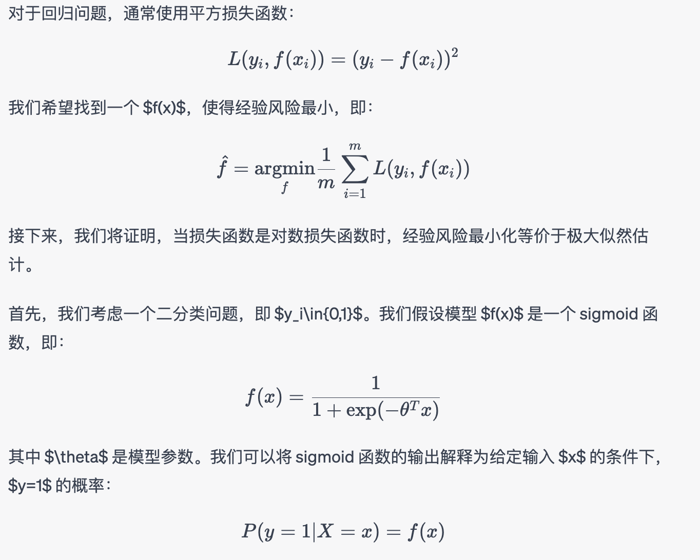
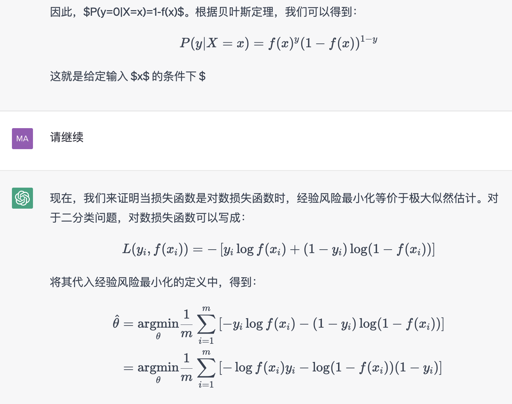
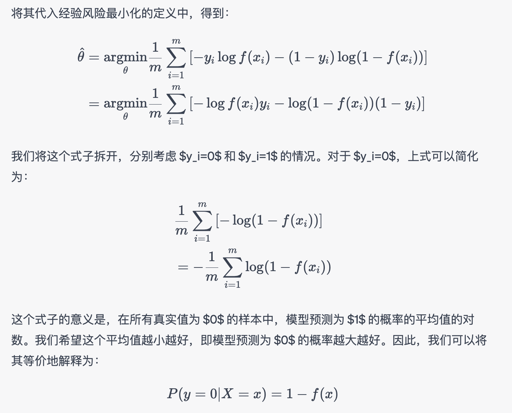
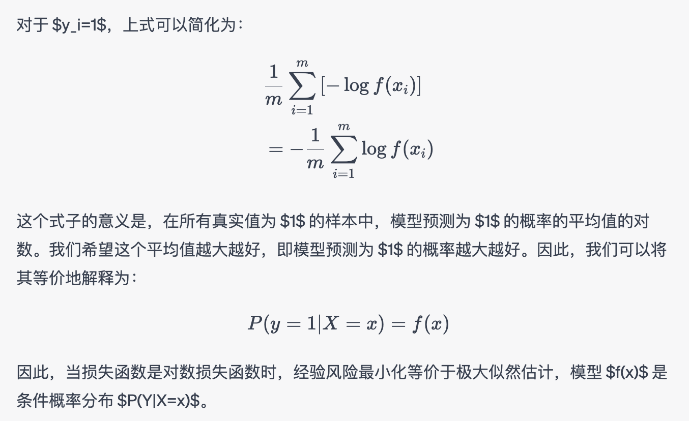