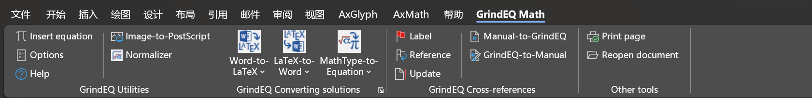

**案例：数学公式相关应用**

  -----------------------------------------------------------------------
  感谢 **仲泰** 贡献！

  -----------------------------------------------------------------------

*ChatGPT数学能力不尽人意，但对做学术研究的人来说是个发散思维的好工具。------陶哲轩*

**制作数学试卷与word排版**

**终极目标**

能够让GPT按照指定的要求生成数学相关的试题和解析，并轻松导入word，无须复杂的排版，微调后即可成为一份优质且美观的练习题或试卷。

**瓶颈问题**

已经可以轻松导入word，并且即使是公式和文字的糅杂，也能呈现较好的排版效果，GPT出的题质量还过得去，但是解析实在是不敢恭维。

**最终效果**

word里的截图，还是非常美观的（上边是试题，下边是解析）。

  ------------------------------------------------------------------------- ---------------------------------------------------------------------------
  
  

  ------------------------------------------------------------------------- ---------------------------------------------------------------------------

**具体步骤**

显然你得能访问ChatGPT官网

可以像我这样提问（当然也可以有你自己的想法）

将上述结果都放在代码块里（方便复制）

解释一下为什么要这么做，因为其他很多情况，你出的题目是既包含公式也包含文字的，浏览器可能会渲染部分latex数学公式，导致复制不方便。

现在效果是这样的

**接下来，全选，然后将latex代码转成officemath即可，在这里我尝试过写VBA宏函数，批量转，但是失败了，如果去第三方网站又嫌麻烦，最终我妥协了，选择了Axmath（付费功能）**

*如果不愿意付费的话，也可以放到latex编辑器里*

当然这个EQ也可以，但也是付费功能（相比之下还是axmath吧）

全选，然后点【将latex代码转换成Axmath公式】即可

有时候公式大小什么的会出现问题，可以【公式比例复位】或【将Axmath转换成Officemath】

等一会会就能得到最终优雅的结果了，同理你也可以让它生成解析

**进阶版**

出某章特定的试题，这样描述比直接问，返回的题质量会稍微高一点点

**ChatGPT辅助数学理论和公式推导**

  -----------------------------------------------------------------------
  感谢 **王茂霖** 贡献！

  -----------------------------------------------------------------------

**一、背景说明**

------By: ChatGPT

**二、示例**

**2.1 概念解释**

**示例1: 解释数学相关的概念**

**2.2 公式推导**

  ------------------------------------------------------------------------------------------------------------------------------------------------------------------------------------------------------------------------------------------------------------------------------------------------
  Tip:
  这块是个人觉得ChatGPT很惊艳的一块，因为数学问题相对于语言来说，往往是更为困难的，但ChatGPT能给出一部分正确的推导思路，可以辅助相关的证明推导。但需要说明的是，在向ChatGPT提相关问题的时候最好能给出多的相关数学背景信息，包括一些公式和名词说明，另外就是ChatGPT生成的推导结果往往是有问题的，
  请大家仔细甄别。

  ------------------------------------------------------------------------------------------------------------------------------------------------------------------------------------------------------------------------------------------------------------------------------------------------

**示例1: 提问函数的积分结果**

备注：\$\\log \\int\_{\\mathbb{R}} \\exp ( \\frac{1}{\\sigma\^2}(\\mu
z - \\frac{1}{2} z\^2) ) \\mathrm{d} z\$
代表公式 
$$\log \int_{\mathbb{R}} \exp ( \frac{1}{\sigma^2}(\mu z - \frac{1}{2} z^2) ) \mathrm{d}z$$

**示例2: 证明一些理论（题来自：《统计学习方法（第一版）》 习题 1.2）**

