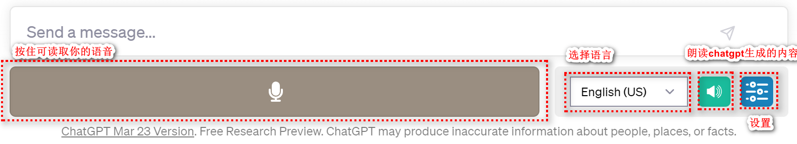
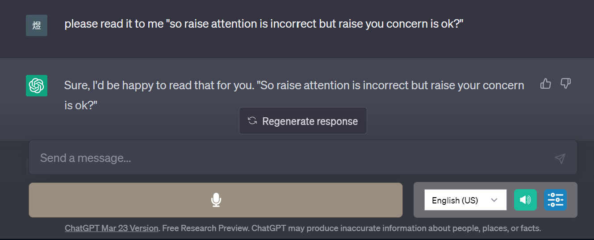
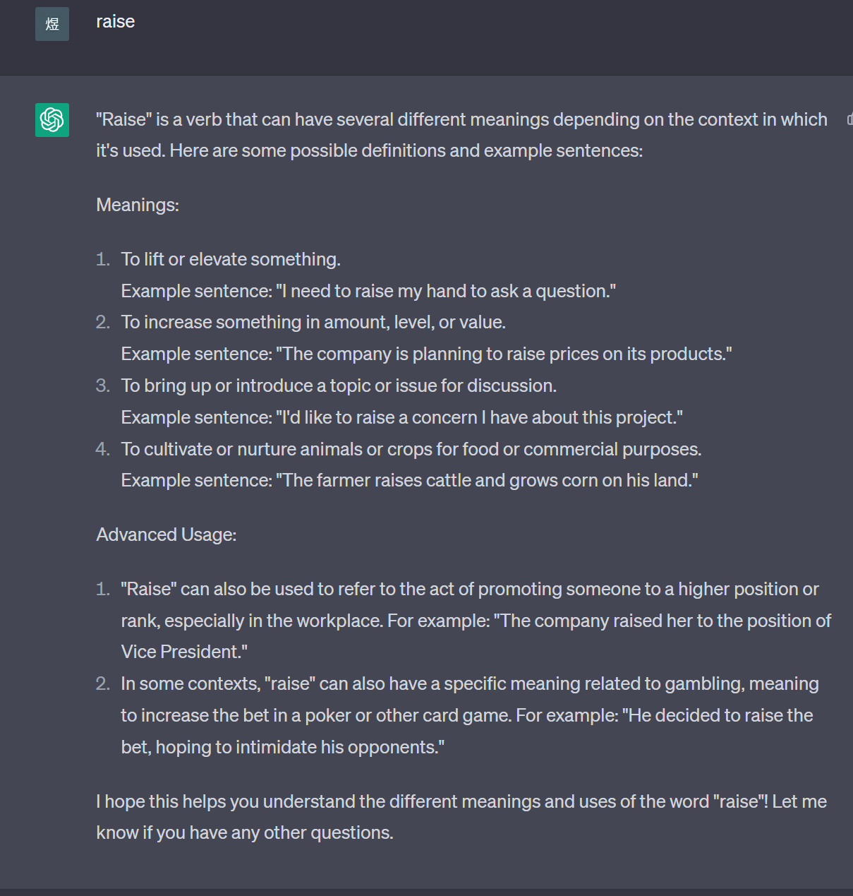
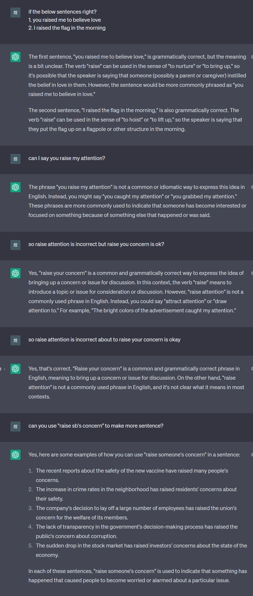

**案例：英语听说读写**

  -----------------------------------------------------------------------
  感谢 **杨煜** 贡献！

  -----------------------------------------------------------------------

**概括**

学习语言，很重要的一部分便是环境，通过GPT打造纯英文交互式的学习环境，让英语更加地道。

案例包括：

听/说 - 通过插件**Voice Control for ChatGPT实现**

读 - 以单词学习为例

写 - 自造例子并询问是否正确

通过大量的纯英文阅读/听/说/写/例子反馈，一定可以加深记忆，达到事半功倍的效果。

**Prompt汇总**

can you help me learn English words?

  -----------------------------------------------------------------------
  Plain Text\
  please follow the below format:\
  1. learn single words, what does it mean? how can i use it\
  2. give some example sentences\
  3. give more advanced useage

  -----------------------------------------------------------------------

i will give you some words next

  -----------------------------------------------------------------------
  Plain Text\
  if the below sentences right?\
  {造句，可以一次多造几个}

  -----------------------------------------------------------------------

can I say {单词or短语}?

so {单词or短语} incorrect but {单词or短语} is ok?

can you use \"{单词or短语}\" to make more sentence?

please read it to me {想要的句子}

**使用详情**

插件准备

在谷歌商店安装 [Voice Control for
ChatGPT](https://chrome.google.com/webstore/detail/voice-control-for-chatgpt/eollffkcakegifhacjnlnegohfdlidhn?hl=zh-CN)，如果报错，按[安装教程](http://aidia.dk)来操作即可。

安装完成后，在chatgpt中效果如下：

学习

**A. 听/说**

利用插件自带功能可实现语音输入，以及自动语音朗读gpt的回复。

使用技巧：

**①
按住space空格键，可以录音并自动语音转文本**，松开会直接提交给chatgpt，但这样没有修改的余地；**建议不要直接松开而是按E，这样会把文本生成在聊天框中**，可以修改

② 通过转成的文本，即可知道自己的发音是否标准，单词句子是否自己想要的;

③ 如果得不到想要的，可以使用prompt：please read it to me {想要的句子},
然后跟读

**B. 读/写**

以学习单词为例：

① 先调教出自己想要的特定格式，比如给出解释，例句以及高级用法。

prompt ：

can you help me learn English words?

  -----------------------------------------------------------------------
  Plain Text\
  please follow the below format:\
  1. learn single words, what does it mean? how can i use it\
  2. give some example sentences\
  3. give more advanced useage

  -----------------------------------------------------------------------

i will give you some words next

② 然后就可以给出你想要学习的单词

注意：如果是短语，需用引号，代表是一个整体

③ 自己尝试造句，并询问是否正确

可以多造几个例句，并多次正反追问

prompt：

  -----------------------------------------------------------------------
  Plain Text\
  if the below sentences right?\
  {造句，可以一次多造几个}

  -----------------------------------------------------------------------

can I say {单词or短语}?

so {单词or短语} incorrect but {单词or短语} is ok?

can you use \"{单词or短语}\" to make more sentence?

