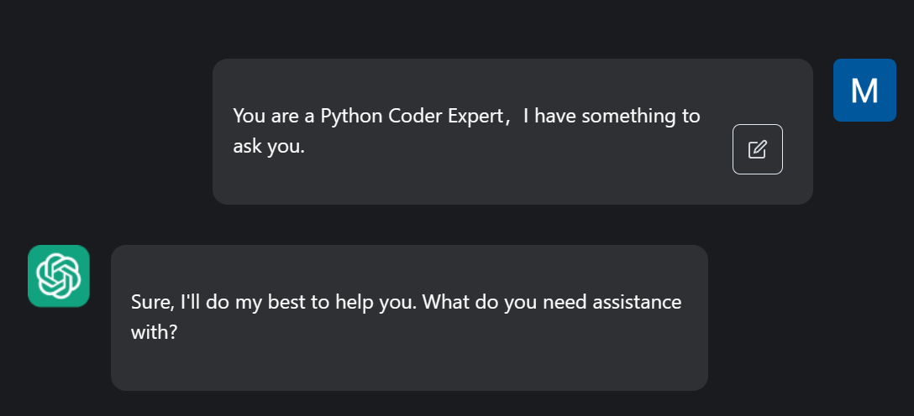
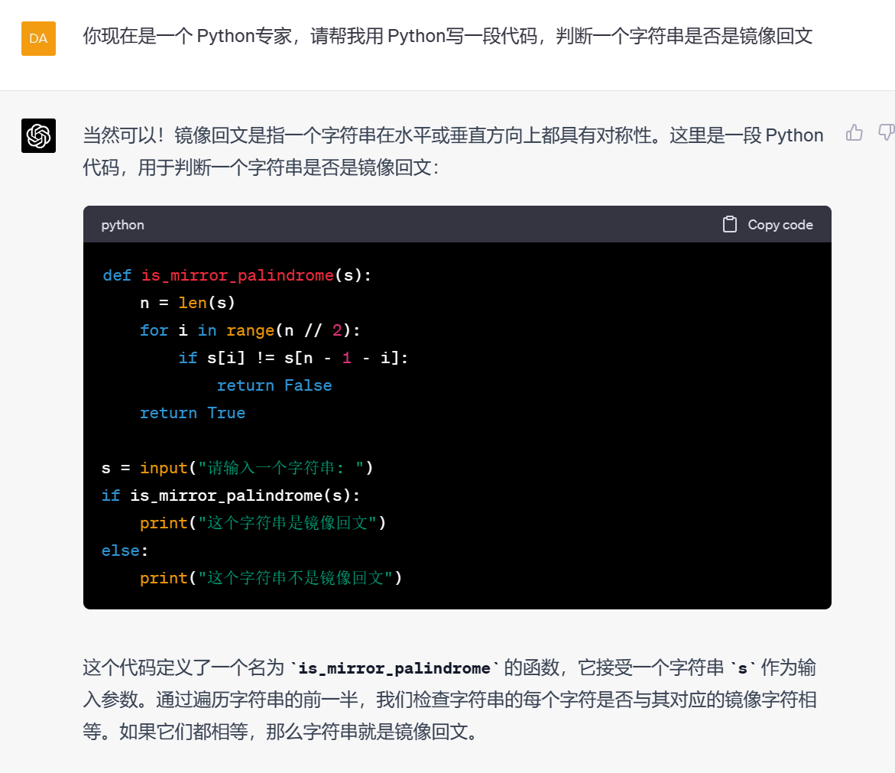
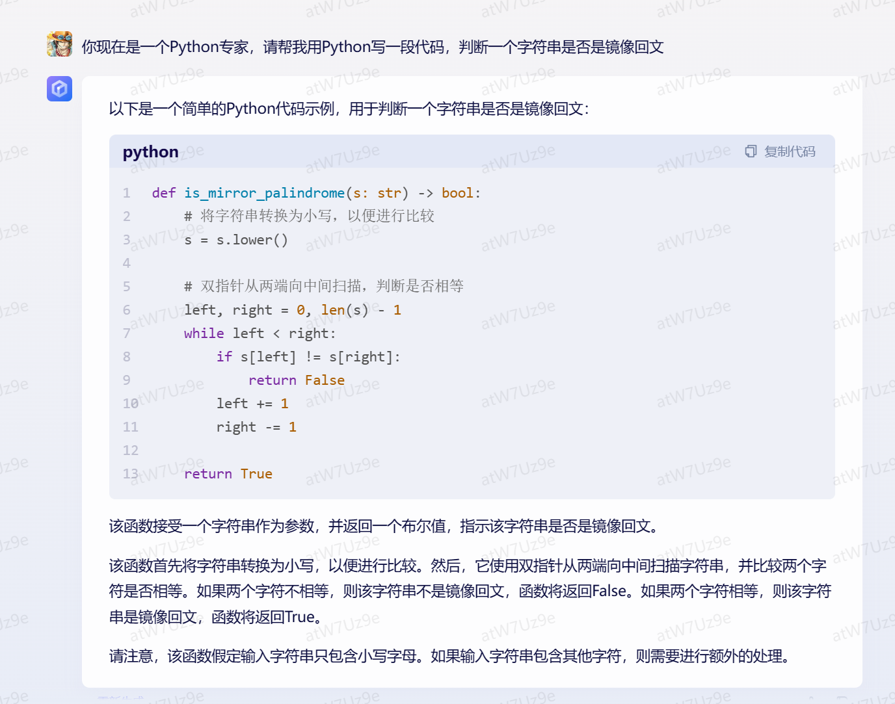
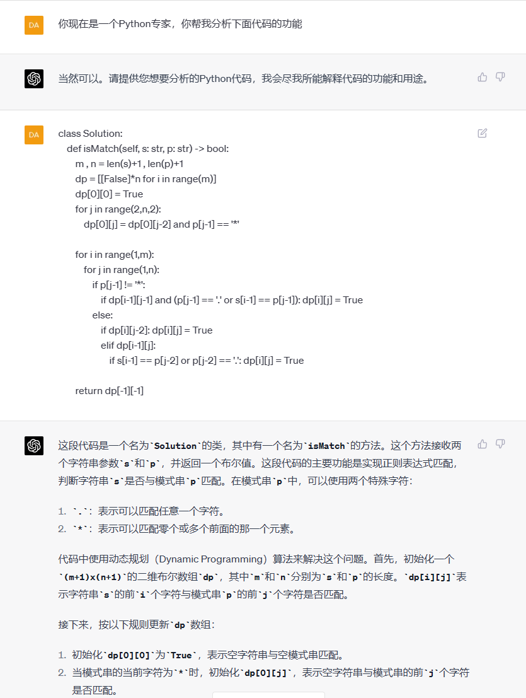
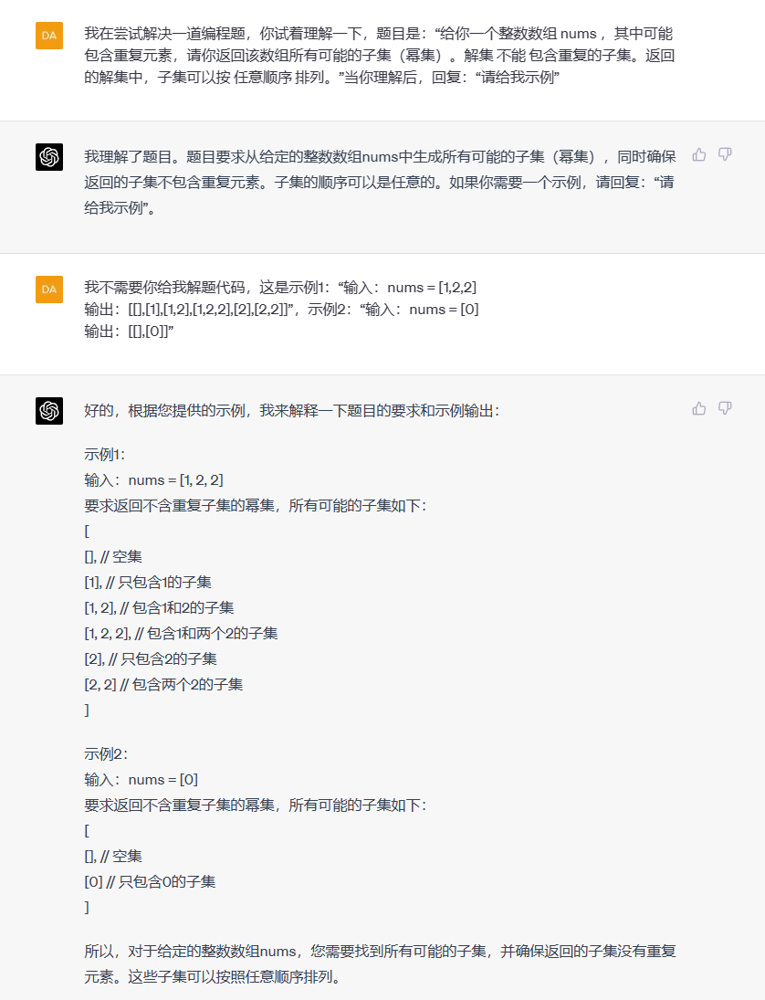
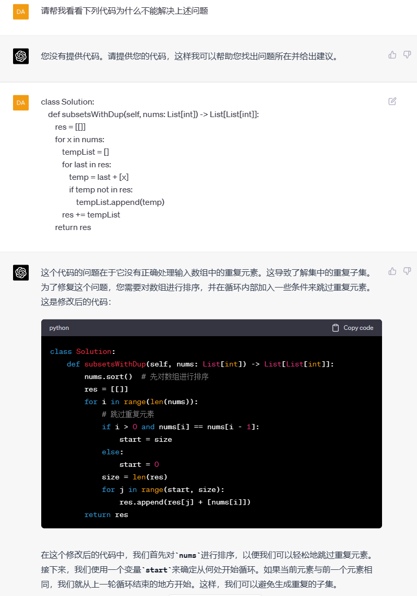
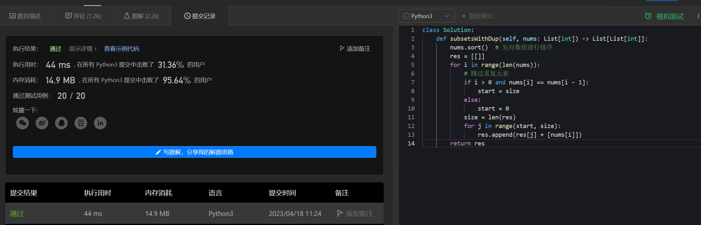
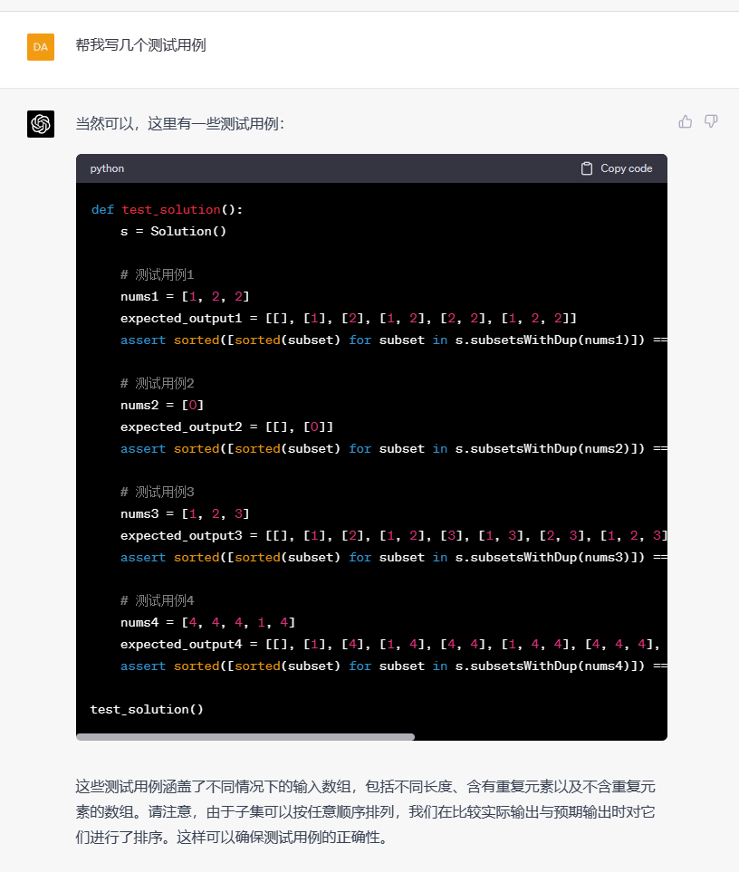

**案例：Python编程辅助**

**1.总体Prompt**

You are a Python Coder Expert，I have something to ask you.

**1.写代码**

**2.解读代码**

**3.代码注释**

**4.解bug**

以力扣一道中等题为例，题目地址：https://leetcode.cn/problems/subsets-ii/

**5.写测试**

**参考**

[https://www.explainthis.io/zh-hant/chatgpt](https://www.explainthis.io/zh-hant/chatgpt)
