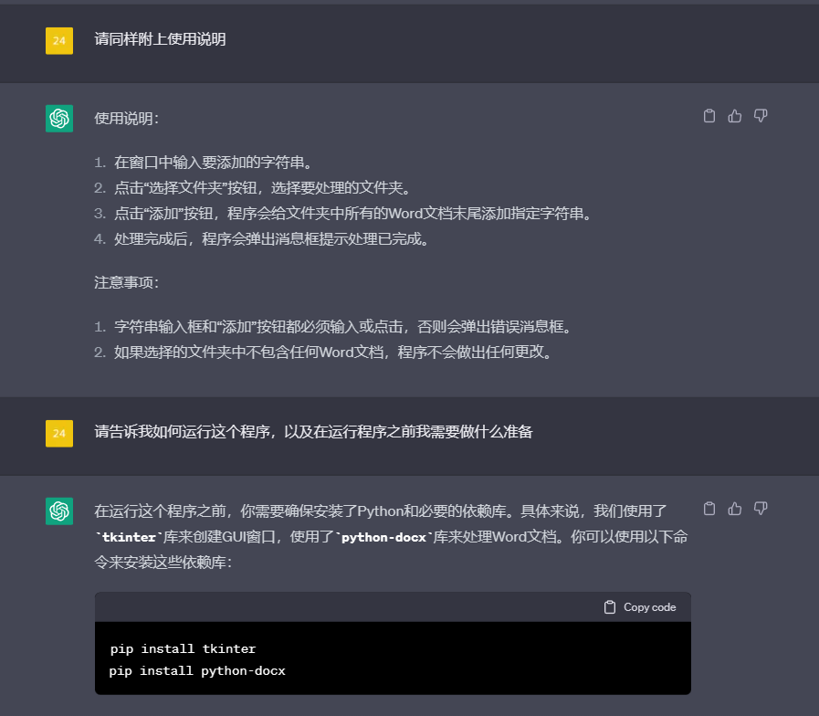
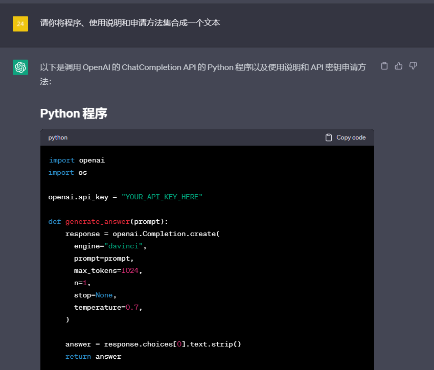

**案例：用 GPT 编写小应用**

  -----------------------------------------------------------------------
  感谢 **邹雨衡** 贡献！

  -----------------------------------------------------------------------

作为经过"专业代码训练"的大语言模型
ChatGPT，其对代码有与生俱来的天赋，能够基于人工提示完成代码编辑、代码润色、代码改写、代码纠错等多种任务，对程序员生产力有着巨大提升。但除了专业程序员可以借助
ChatGPT 来加速、改进自己的编程成果外，普通用户也可以要求 ChatGPT
来编写简单程序并通过其给出的使用说明运行程序，从而借助程序解决生活、工作中的小问题。正如大家所知道的，ChatGPT
还不能接触现实生活，但我们可以通过运行它给出的程序从而让它帮助我们解决现实生活中的问题。

本文将给出一些示例展示如何通过 ChatGPT
编写程序来实现一些小巧而实用的功能，从而解决现实生活中的一些问题。

**实现 Word 的批量处理**

在日常工作中，往往会遇到需要对多个 Word
文档执行重复操作的情况，这是一项繁琐、单调又无法绕过的任务。我们可以给出指令让
ChatGPT 生成一个 Python 程序，来实现 Word
文件的批量处理------例如，向一个指定文件夹里的所有 Word
文件末尾添加一句话。

希望让 ChatGPT
编写一个程序来解决实现一个小功能，我们的指令一般需要三个基本元素：

使用的高级语言。虽然如果不指明使用什么语言，ChatGPT 会自动选用 Python
编写程序，但由于不同语言的运行方式不同，还是建议指明使用的语言。

希望实现的功能。如在本案例中，需要实现的功能为"将一个文件夹里的所有Word文件末尾加上一句话"。

使用说明，即要求 GPT 给出该程序的使用说明，以便于非程序员使用该程序。

例如，在本案例中，我们给出这样的指令：

GPT 的回应为：

基于上述使用说明，复制代码并运行，即可实现这一基本功能。

我们可以通过增加一些指令来使 GPT
生成的程序更加适合非程序员操作，例如，使用
GUI（图形化界面）的形式指定文件夹和要插入的语句：

限于篇幅，此处不再附上修改之后的代码，但经过测试，其生成的 Python
代码是可以顺利运行实现所需功能的。

在进一步改进之后，需要注意两点：

由于程序代码较长，GPT
的输出可能会被截断。对于这种情况，键入"请继续"让它完成被截断的输出即可。

> 

改进之后，GPT不会自动生成使用说明，需要再次提示它给出使用说明。同时，如果是改进为 GUI
形式，使用说明为如何操作
GUI，对于使用程序，需要提示它"请告诉我如何运行这个程序，以及在运行程序之前我需要做什么准备"。

> 
> 也可以要求 GPT 将使用说明和所需准备整合为一个更具体的使用说明：
>
> 

在日常生活中，可以通过此功能实现更多灵活、小巧的应用，只需将所需实现的功能替换即可。需要注意的是，在描述需要实现的功能时，可以尽可能多地使用专业术语、限定实现方法，从而可以保证
GPT 的输出程序也更专业、稳定。

**编写一个简单爬虫**

编写一个简单爬虫，实现对某些网站页面、数据的获取也是科研、工作中的常见任务。GPT
同样可以针对指定网站编写一个爬虫，但需要注意，其不能浏览网页，因此可能会给出错误的解析方法，导致编写的程序不能实现指定效果。

例如，我们可以让它编写一个程序爬取 Bing
搜索"GPT"的所有结果，同上文的基本要素给出指令：

但注意，由于 GPT
经常会给出错误的解析方法，上述代码并不能正确地获取所需信息，其运行结果如下：

只找到了链接，没有打印出标题文本，如果运气不好的话，可能链接也找不到。

因此，在使用 GPT 获取数据时，我们需要换一种方法，例如，要求 GPT
获取指定网页的全部文本内容和图片：

该种方式能够绕过不同网页的不同组织形式，从而实现对于各种网页信息的获取。不过，该种方式生成的代码运行时也有可能出现报错，如果出现报错，可以将报错复制粘贴给
GPT，其会自动修正代码：

基于上述指令，再迭代修正报错的代码，GPT
一般就能给出正确的、可运行的、能够实现目标的代码。

**编写一个调用其自身 API 的程序**

考虑到网页端存在相当大的不稳定性，可能由于各种原因导致无法访问，我们可以让
GPT 编写一个调用其自身 API 的程序，作为网页端无法访问的备用途径。

注意，不能直接要求 GPT 编写一个调用其自身 API
的程序，它会告诉你它没有可调用的 API：

你需要指定调用 OpenAI 提供的 ChatGPT 的API：

该种情况下给出的使用说明较为简单，可以进一步询问如何申请 API 密钥：

并可以要求其将程序、使用说明、申请方法都集合在一起：

在 ChatGPT Plugin 还未广泛开放的情况下，ChatGPT
仍然存在很多局限，但我们可以通过让其编写程序来实现一些简单功能，从而让
GPT 帮我们处理一些简单的生活需求。基于 ChatGPT
还可以编写更多更有趣、有实际使用意义的程序，极大提升日常工作生活的便捷程度，欢迎大家更多、更广泛地去探索。
