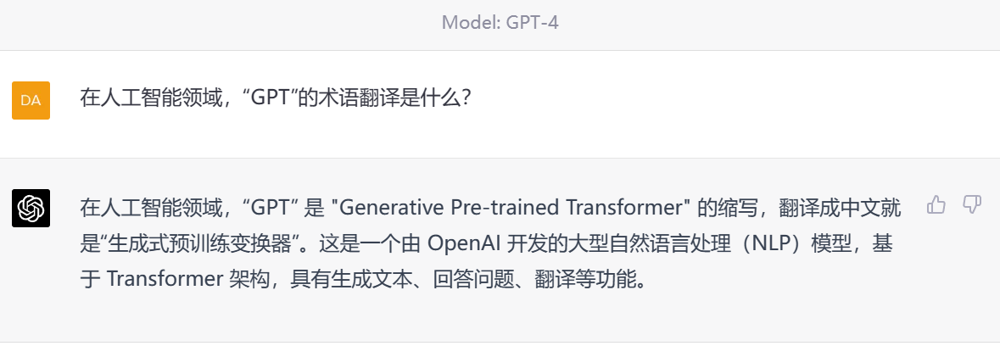

**案例：科研辅助**

普通人使用ChatGPT重在磨练基本功，我下面提供的这套基本功如果你能融会贯通，对内容生产者们有着魔法级别的帮助，至少提升10倍的生产效率。

核心Prompt：

帮我复述一下\
帮我解释一下\
帮我翻译一下\
帮我润色一下

**0.文献检索**

可能会出错，可能查不到训练数据发表后的文献

**1.领域术语翻译**

**2.润色**

**3.研究思路**

细化

**4.综述**

作者：IT人刘俊明\
链接：https://www.zhihu.com/question/583232012/answer/2897193484\
来源：知乎\
著作权归作者所有。商业转载请联系作者获得授权，非商业转载请注明出处。

首先，我本人并不反对学生使用ChatGPT，相反我正在积极鼓励组里的同学来使用ChatGPT，一方面作为计算机专业的同学来说，应该积极拥抱这种现象级的人工智能产品，从而来提升自身的专业认知能力，另一方面ChatGPT也确实能够给很多同学带来新的启发，我本人也并不否认ChatGPT在创新方面的应用潜力。

在读研的不同阶段会遇到不同的问题，导师往往也会有相应的要求，我结合这些问题和要求来说说如何运用ChatGPT。由于我们组的老师和同学也没有积累太多使用ChatGPT的经验，所以各位同学也要结合自身和课题组的实际情况来使用ChatGPT。

对于研一的同学来说，使用ChatGPT的重点在于资料的收集、整理和辅助分析，以及培养自己的提问能力。我一直比较重视培养学生的提问能力，在参加组会的时候，我会要求每名同学都至少提出一个问题，我认为提问是培养学生证伪思维比较有效的方式之一。

在最近的组会当中，我们增加了一个环节，那就是每名同学所提出的问题，要结合ChatGPT给出的答案做进一步解析，这在一定程度上提升了交流的效率，很多同学在参与讨论时也更加积极了。

研一同学所面临的比较普遍的问题有三个，其一是不知道如何奠定科研基础，其二是不知道如何做总结，其三是不知道如何找到科研着力点。这三个问题都可以使用ChatGPT来提供帮助，很多同学在写自己的第一篇综述的时候通常会遇到很多困难，此时也完全可以借助ChatGPT来提供帮助。

对于研二、研三的同学来说，由于已经有了比较明确的科研方向，所以一些基础的任务就可以借助ChatGPT来完成，比如基础的算法实现问题、编程问题等都可以借助ChatGPT的帮助来提升效率。

对于博士研究生同学来说，ChatGPT同样有一定的使用价值，尤其在涉及到交叉领域的创新时，ChatGPT能够让很多同学得到比较专业的建议，甚至能够给出一些创新方向的具体建议，当然这更适合具有一定独立科研能力的博士研究生同学，**对于硕士研究生同学来说，要慎重面对ChatGPT的回答。**

**参考**

研究生如何利用 ChatGPT 帮助开展日常科研工作？ - 知乎\
[https://www.zhihu.com/question/583232012](https://www.zhihu.com/question/583232012)

  --------------------------------------------------------------------------------------------
  作业（选做）：欢迎提交你使用chatgpt辅助科研的例子，我们将评选**好用的"chatgpt科研辅助"。**

  --------------------------------------------------------------------------------------------
