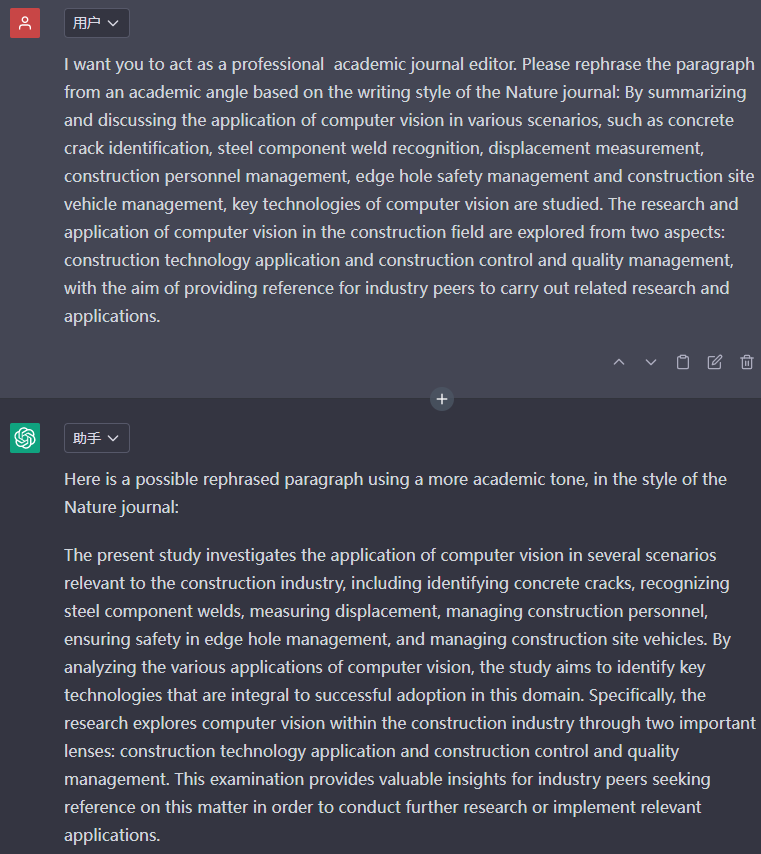

**案例：论文润色**

  -----------------------------------------------------------------------
  感谢 **张友东、姜金** 贡献！

  -----------------------------------------------------------------------

**汉译英并润色**

以下面这段中文为例：

*"随着大型语言模型的规模不断扩大，运行它所需的计算资源也在不断增加。运行它所需的计算资源。尖峰神经网络（SNNs）已经成为深度学习的一种节能方法。在深度学习中出现了一种高能效的方法，它利用稀疏的和事件驱动的
激活来减少与模型推理相关的计算开销。虽然它们在许多计算机视觉任务上已经与非尖峰模型具有竞争性。视觉任务上具有竞争力，但SNNs也被证明在训练上更具挑战性。因此、
它们的性能落后于现代深度学习，而且我们还没有看到SNNs在语言生成中的有效性。我们还没有看到SNNs在语言生成中的有效性。在本文中，受RWKV
语言模型的启发下，我们成功地实现了
\"SpikeGPT\"，这是一个生成性语言模型。"*

*------来自 https://arxiv.org/abs/2302.13939 摘要的部分翻译*

**直接翻译**

Translate \"XXX\"

**使用学术语言和逻辑**

I want you to act as an English translator. Keep the meaning same, but
use academic language and logic. My paragraph is \"XXX\".

**对文本进行改进和更正**

I want you to act as an English translator. You should translate it and
make improvements and corrections to my text. My paragraph is \"XXX\".

**使用修饰知识和经验的有效写作技巧**

I want you to act as an English translator. You should use artificial
intelligence tools, such as natural language processing, and retouching
knowledge and experience of effective writing techniques to reply. My
paragraph is \"XXX\".

**更学术、更高级的英语单词和句子**

I want you to act as an English translator. I want you to replace my
simplified A0-level words and sentences with more academic, upper level
English words and sentences. My paragraph is \"XXX\".

**综上一个prompt**

I want you to act as an English translator, spelling corrector and
writing improver. You should translate it and make improvements and
corrections to my text. Keep the meaning same, but use academic language
and logic. You should use artificial intelligence tools, such as natural
language processing, and rhetorical knowledge and experience of
effective writing techniques to reply. I want you to replace my
simplified A0-level words and sentences with more academic, upper level
English words and sentences. My paragraph is \"XXX\".

**直接润色英文**

以下面这段英文为例：

*By summarizing and discussing the application of computer vision in
various scenarios, such as concrete crack identification, steel
component weld recognition, displacement measurement, construction
personnel management, edge hole safety management and construction site
vehicle management, key technologies of computer vision are studied. The
research and application of computer vision in the construction field
are explored from two aspects: construction technology application and
construction control and quality management, with the aim of providing
reference for industry peers to carry out related research and
applications.*

*------来自https://zhuanlan.zhihu.com/p/618795297*

**语法修改**

I want you to act as a professional academic journal editor. Please
revise the grammar of the following passage: XXX

这里的语法修改ChatGPT不单单是一些简单语法的修改，还包括句子结构的改变。

**从固定期刊角度润色**

I want you to act as a professional academic journal editor. Please
rephrase the paragraph from an academic angle based on the writing style
of the XXX journal: XXX

**从高质量论文角度润色**

I want you to act as a professional academic journal editor. Please
rephrase this paragraph from an academic angle based on the writing
style of papers with high impact factors: XXX

**根据大牛写作风格润色**

该方法可以一定程度上避免"AI检测"问题。

Please summarize the writing style of this article：《\*\*\*》

Who is the first author of this article

You are now playing \*\*\*. Please rewrite the following in Ashish
Vaswani\'s essay writing style:

总结：

Please summarize the writing style of this article：《\*\*\*》

Who is the first author of this article

You are now playing \*\*\*. Please rewrite the following in Ashish
Vaswani\'s essay writing style: "你的文本"

**prompt总结**

|        | 场景               | prompt                                                                                                                                                                                                                                      |
|--------|------------------|---------------------------------------------------------------------------------------------------------------------------------------------------------------------------------------------------------------------------------------------|
| 汉译英并润色 | 直接翻译             | "Translate ""XXX"""                                                                                                                                                                                                                         |
|        | 使用学术语言和逻辑        | "I want you to act as an English translator. Keep the meaning same, but use academic language and logic. My paragraph is ""XXX""."                                                                                                          |
|        | 对文本进行改进和更正       | "I want you to act as an English translator. You should translate it and make improvements and corrections to my text. My paragraph is ""XXX""."                                                                                            |
|        | 使用修饰知识和经验的有效写作技巧 | "I want you to act as an English translator. You should use artificial intelligence tools, such as natural language processing, and retouching knowledge and experience of effective writing techniques to reply. My paragraph is ""XXX""." |
|        | 更学术、更高级的英语单词和句子  | "I want you to act as an English translator. I want you to replace my simplified A0-level words and sentences with more academic, upper level English words and sentences. My paragraph is ""XXX""."                                        |
| 直接润色英文 | 语法修改             | I want you to act as a professional academic journal editor. Please revise the grammar of the following passage: XXX                                                                                                                        |
|        | 从固定期刊角度润色        | I want you to act as a professional academic journal editor. Please rephrase the paragraph from an academic angle based on the writing style of the XXX journal: XXX                                                                        |
|        | 从高质量论文角度润色       | I want you to act as a professional academic journal editor. Please rephrase this paragraph from an academic angle based on the writing style of papers with high impact factors: XXX                                                       |
|        | 根据大牛写作风格润色       | "1. Please summarize the writing style of this article：《***》2. Who is the first author of this article 3. You are now playing ***. Please rewrite the following in Ashish Vaswani's essay writing style: “你的文本”"                            |
                                                                                                                                                                                                                                        
**gpt-based科研工具推荐**

**chatgpt_academic：**[https://github.com/binary-husky/chatgpt_academic](https://github.com/binary-husky/chatgpt_academic)

**ChatPaper：**[https://github.com/kaixindelele/ChatPaper](https://github.com/kaixindelele/ChatPaper)

**贡献者**

主要贡献者：张友东

直接润色英文-根据大牛写作风格润色：姜金

参考链接

[https://zhuanlan.zhihu.com/p/618795297](https://zhuanlan.zhihu.com/p/618795297)

[https://arxiv.org/abs/2302.13939](https://arxiv.org/abs/2302.13939)
