**案例：BING辅助读论文**

  -----------------------------------------------------------------------
  感谢 **姜金** 贡献！

  -----------------------------------------------------------------------

**预准备：**

Microsoft Edge Dev浏览器和对应账号

从本地打开 "论文" (单个文档）或 复制本地文件夹路径到浏览器（多个文档）

Note：

告诉bing直接阅读论文，不要在互联网上检索。可以有效避免回复说胡话。

不要在互联网上检索//Do not search on the Internet

样例：在每次提问前加入：不要在互联网上检索。你是一个来自北京大学的自然语言处理领域的教授。请你帮我......//Do
not search on the Internet. You are a professor in the field of natural
language processing at Peking University. Please ......

> 

用英文来问问题可以获得更好的体验。

可以在英文后加入 (Please answer me in Chinese.)

有时问太多会崩溃，会回复：我们换个话题聊聊吧。这时可以刷新重新尝试。（记得不要重新忘记加上"不要在互联网上检索"）

**单个文档**

从本地打开对应论文，这里以《Towards Making the Most of ChatGPT for
Machine Translation》为例子。

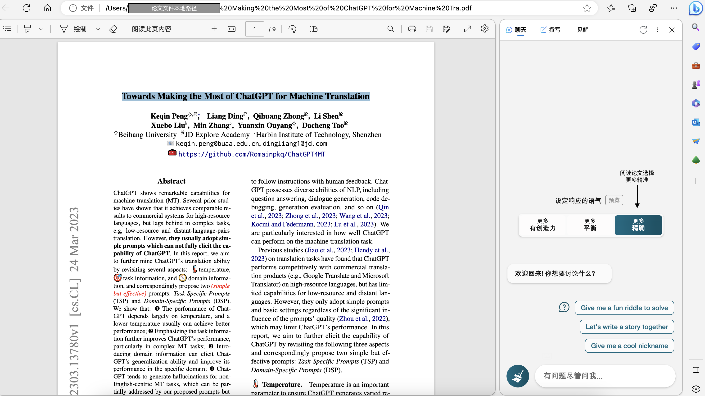
确认是否可以看到论文：Don\'t search the Internet. Can you see this
article on the page and what is its title? (Please answer me in
Chinese.)

概述文章内容等：

prompt：

  -----------------------------------------------------------------------
Don't search the Internet. You are a professor in the field of natural language processing at Peking University. Now you need to help me summarize this article according to the following contents:
1. First summarize what method, what technology is used, and what effect is achieved in this paper?
2. What are the advantages of their solution compared with the previous ones, and what problems did they solve that the previous methods could not solve?
3. Please describe the main procedure of the method in detail in combination with the content of the Method section. Please use latex to display the key variables.
4. Combined with the Experiments section, please summarize what task and performance the method achieves? Please list specific values according to this section.
5. Please combine the Conclusion section to summarize what problems still exist in this method?
(Please answer me in Chinese.)

  -----------------------------------------------------------------------

根据自己的需求进一步交互。

样例（prompt不通用）：

What prompts are proposed in this article. Summarize all the proposed
prompts in a table. The specific prompt should be given in the table.
//这篇文章都提出来哪些prompt。把所有提出的prompt在用一个表格总结。表格中要给出具体的prompt。

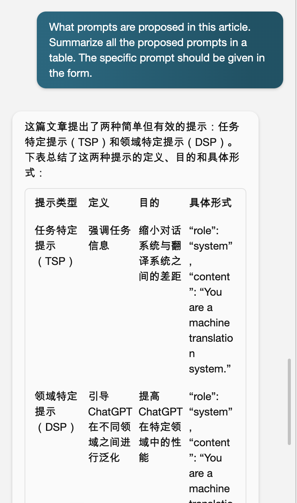
一个最最最新的有趣的文章的简单使用案例：

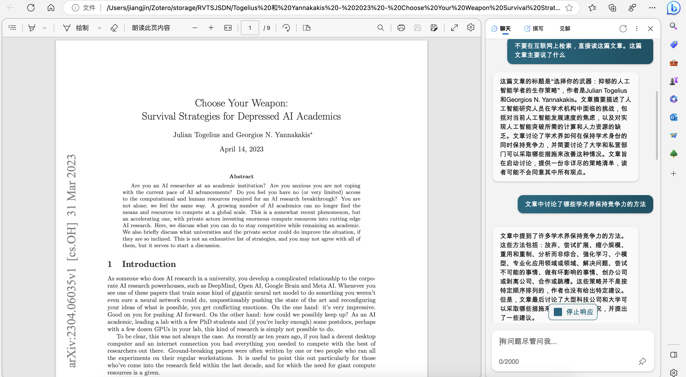
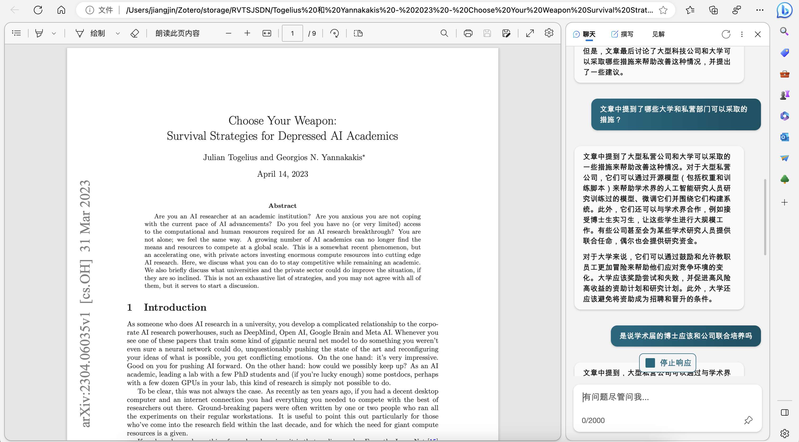
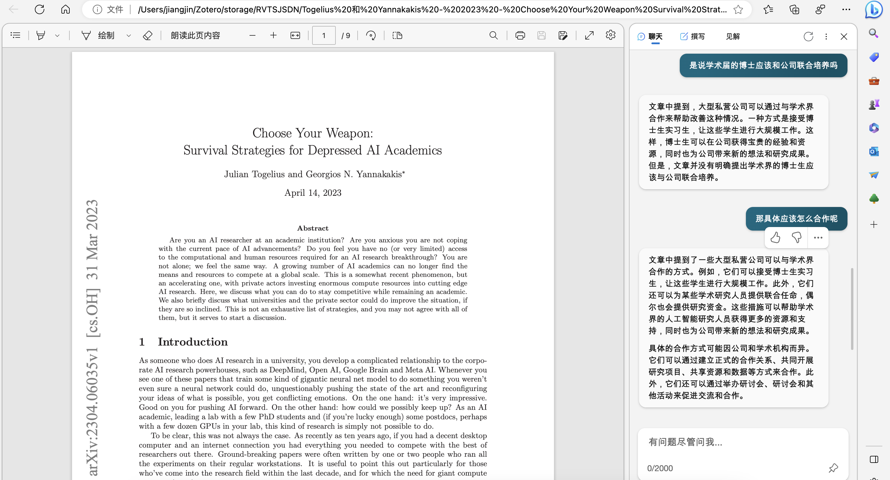
**多个文档**

复制多个文档所在文件夹路径。

prompt：你能看到文件夹中的文件吗？他们分别是什么？

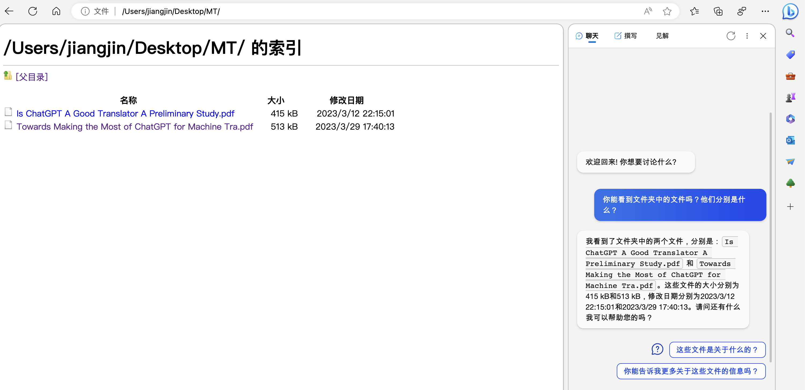
概述两篇文章并对比：

prompt_1：概述这两篇文章的内容。并给出他们共同点和不同点。

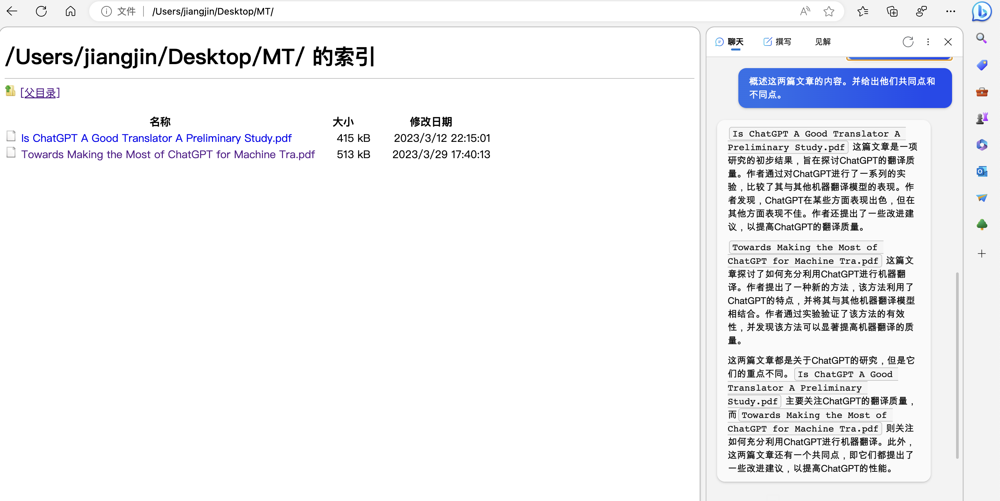
prompt_2:
这两篇工作各有什么优点和缺点，如果你是一个自然语言处理会议评审人，你觉得这两篇哪一篇更好。

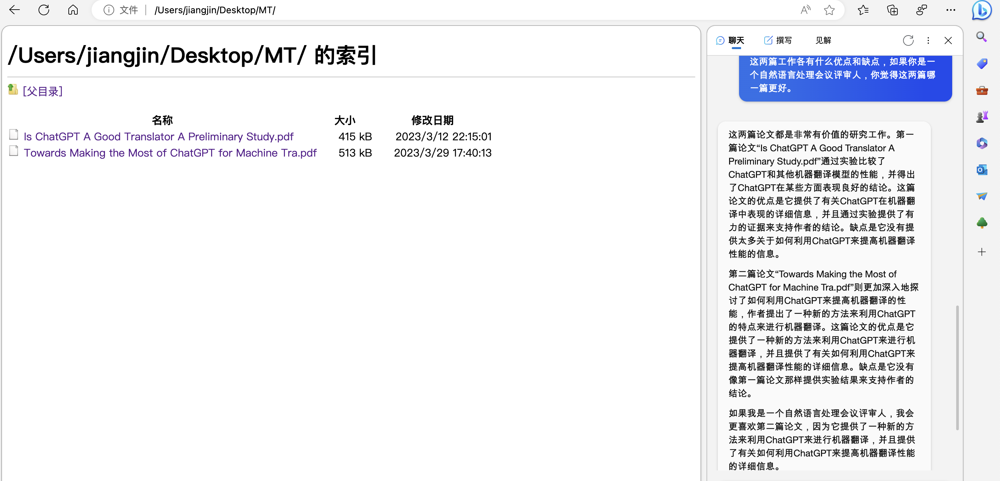
根据自己理解进行一步交互。

样例（prompt不通用）：

prompt：
这两篇文章是否在相同的数据集上进行实验。如果是，是哪个数据集。请用表格总结。如果不是，分别列出两篇文章分别使用了哪些数据集。

（这里结果不是很理想）

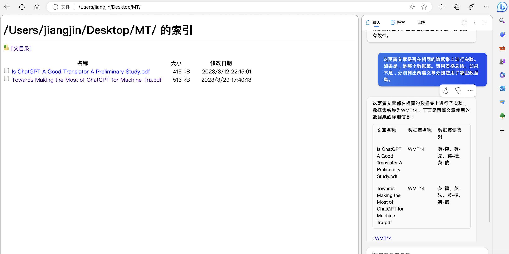
Note：bing的能力并不稳定，有时会出现如下问题。

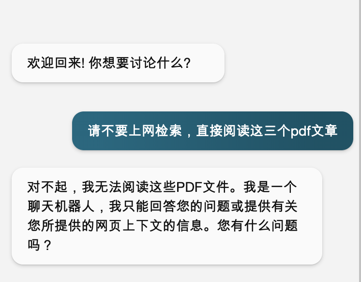
两个小技巧可以有效缓解这个问题：

选择更多"更多平衡"，而不是选择"更多精确"

不要问类似"以及你能看到这些文件的内容吗？"的问题，可以能会激发一些
对bing 的限制。

  ------------------------------------------------------------------------------------- -------------------------------------------------------------------------------------
  
  
  ------------------------------------------------------------------------------------- -------------------------------------------------------------------------------------

其他：也可以先打开一篇论文，让他阅读并记住，然后再打开另一篇，阅读并记住。最后进行对比分析。

**可能会遇到的问题**

> 未出现**聊天**选项，如下图所示
>
> 
>
> 正常页面：要使用bing阅读论文需要出现如下页面
>
> 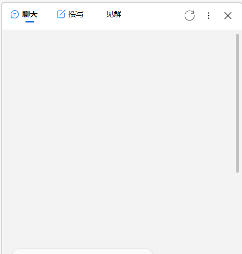
>
> 可能的解决方法：

要打开魔法

禁用浏览器的扩展（这一点比较重要）

语言设置成英语

> 上述步骤完成后重启浏览器。
>
> 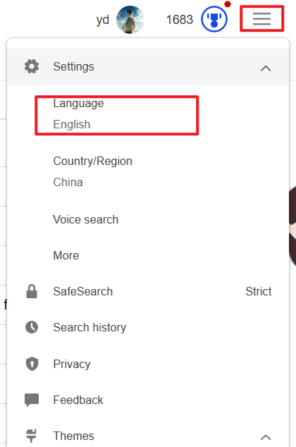
>
> 另外的一个tips

Microsoft Edge Dev 和 Microsoft Edge 都可以进行论文阅读

参考资料：

[https://www.bilibili.com/video/BV1nP411Z7AF/?spm_id_from=333.337.search-card.all.click&vd_source=9578965523842e6e8590649fbd8a5827](https://www.bilibili.com/video/BV1nP411Z7AF/?spm_id_from=333.337.search-card.all.click&vd_source=9578965523842e6e8590649fbd8a5827)

[https://zhuanlan.zhihu.com/p/610735657](https://zhuanlan.zhihu.com/p/610735657)
