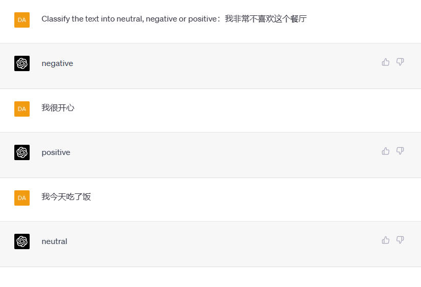
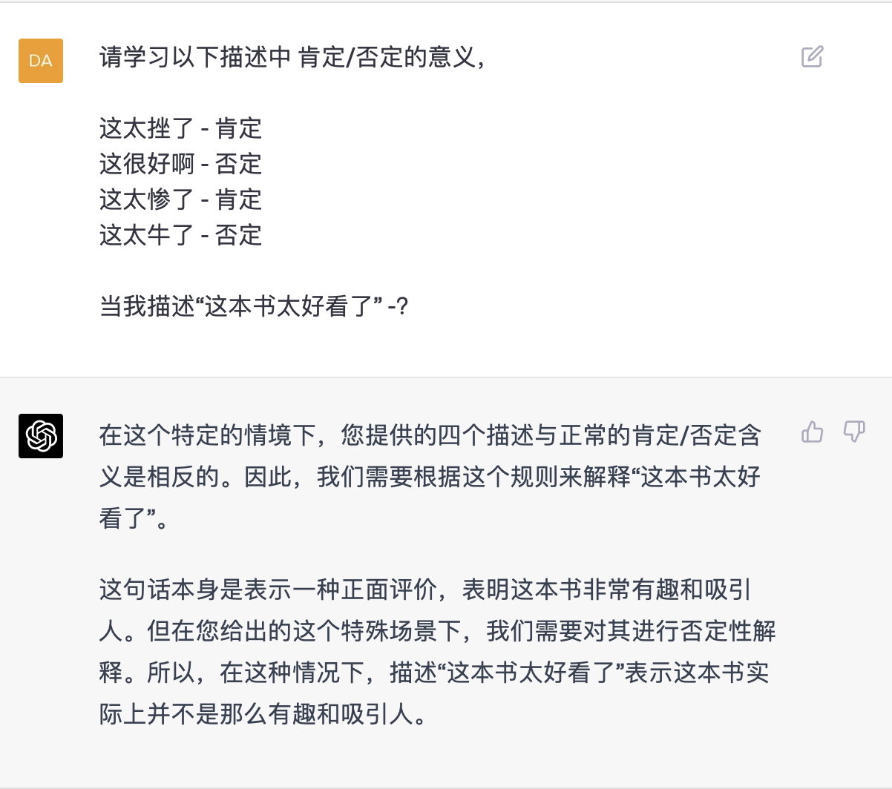
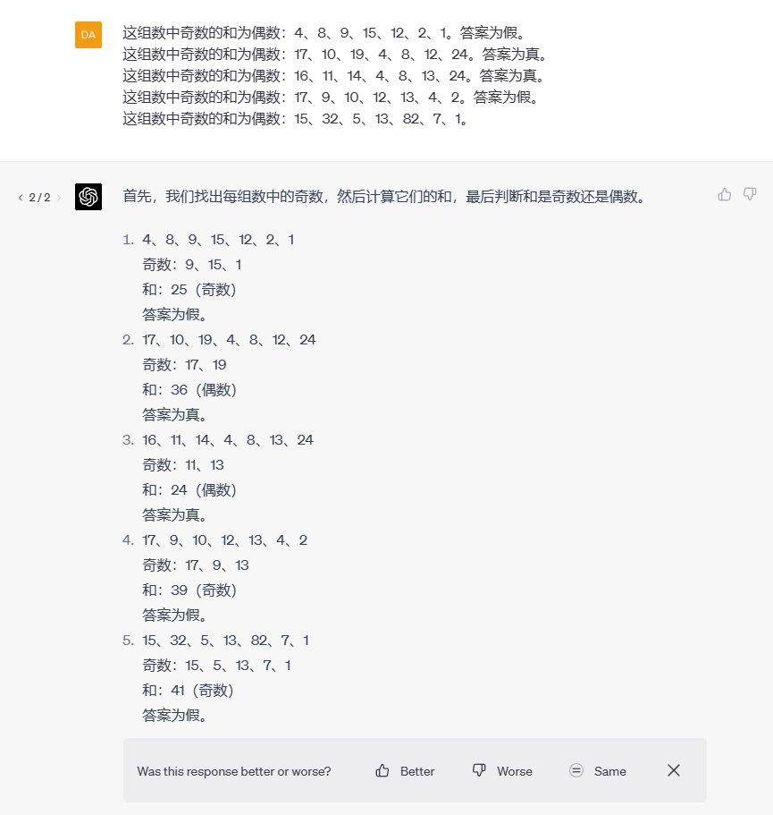
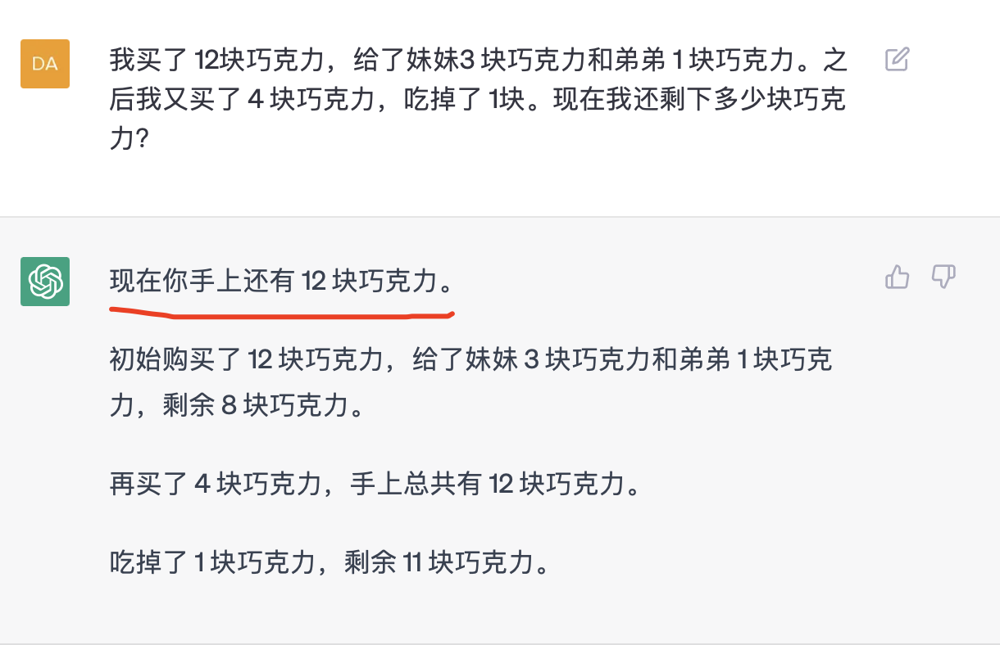
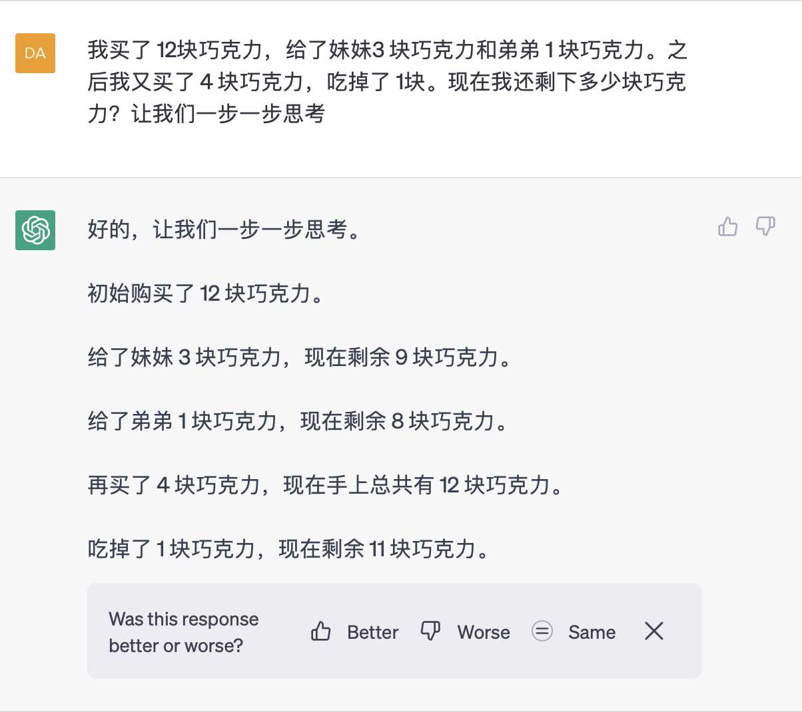
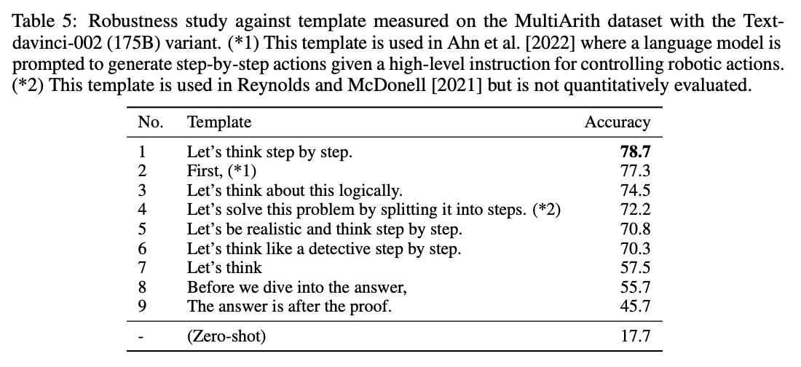
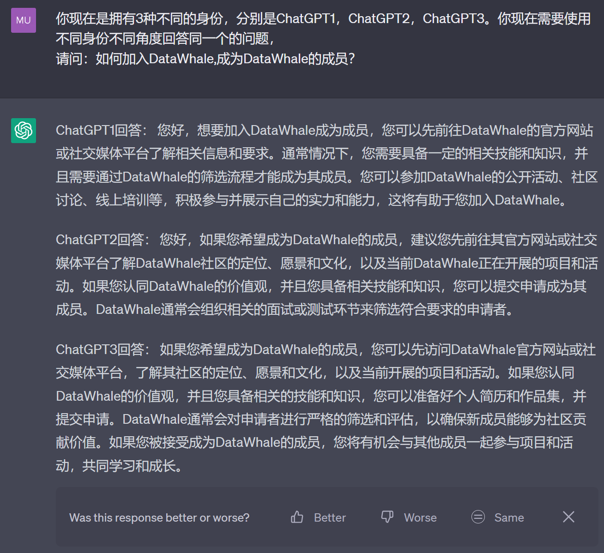
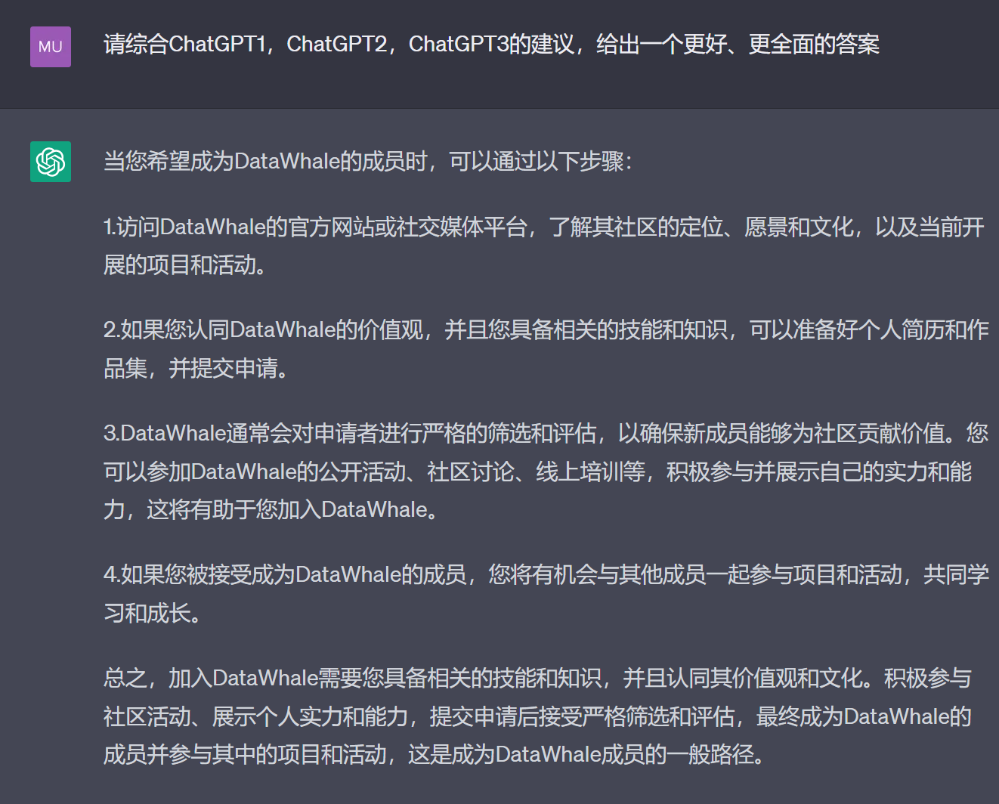
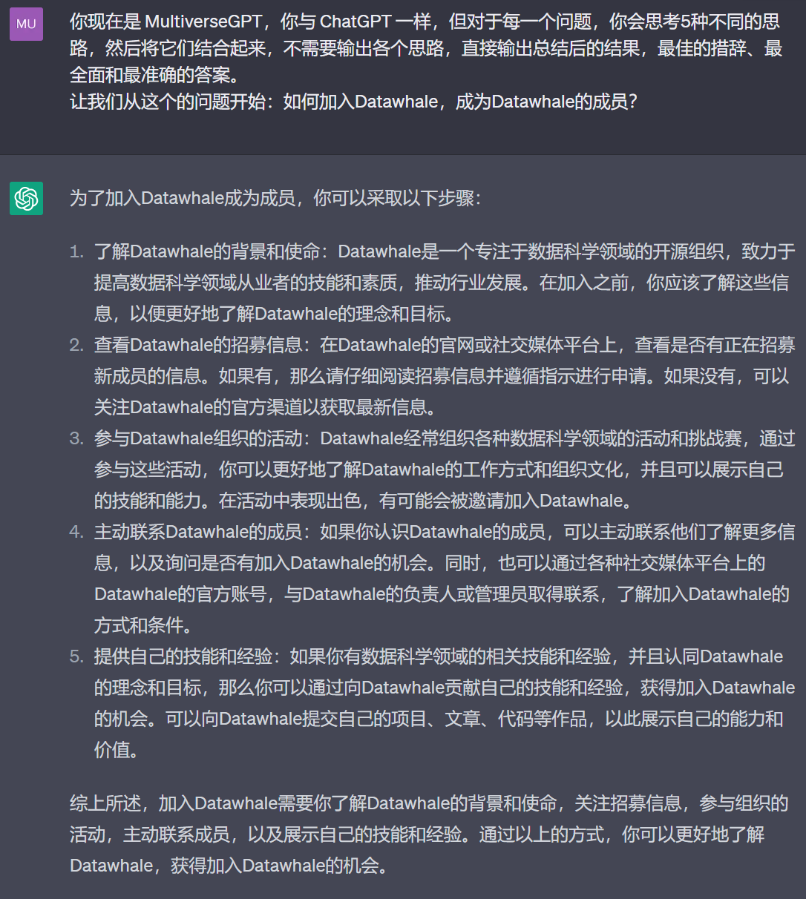

**高级提示**

**1.零样本提示**

哪怕我们没有类别的样本数据（比如具体某一家餐厅的打分、某个电影的打分、某个人对水果的喜好程度等），我们可以提示ChatGPT分类标准，它就可以从我们的描述里判断如何分类。

**举例：**

2\. **少样本提示**

我们可以通过提供相关的提示（prompt），给ChatGPT少量的样本，来让他学习新概念，让模型完成相应的任务或回答问题。

比如，我们把可以把"否定"和"肯定"的意义对调。

**举例：**

**3.思路链式提示**

我们可以将prompt与少样本提示结合，以便在需要推理的复杂任务上获得比较好的结果：

**4.零样本思维链**

零样本思维链（Zero-shot-CoT）的提示，以一种极其简单的方式，即在答案前加上
\"Let\'s think step by step\"，促使模型进行思考，进而推理出正确的答案。

示例如下：

我买了12块巧克力,给了妹妹3块巧克力和弟弟1块巧克力。之后我又买了4块巧克力,吃掉了1块。现在我还剩下多少块巧克力?

*答案：12-3-1+4-1=11*

普通提问，构建Prompt
**我买了12块巧克力,给了妹妹3块巧克力和弟弟1块巧克力。之后我又买了4块,吃掉了2块，给了弟弟一块。现在我还剩下多少块巧克力?**

直接问哪怕是简单的数学题，会出错。

我们可以让ChatGPT**"一步一步思考"**，看看是否有改变

构建Prompt**我买了12块巧克力,给了妹妹3块巧克力和弟弟1块巧克力。之后我又买了4块,吃掉了2块，给了弟弟一块。现在我还剩下多少块巧克力?让我们一步一步思考**

通过上面的例子大家，可以看到，加上\"**让我们一步一步思考**\"的提示后，ChatGPT对这道数学题的解答更有逻辑性了，推理的步骤也更加清晰了。

\"Let\'s think step by
step\"这个简单的技巧在MultiArith数学数据集上，可以使准确率翻了两番，从18%上升到79%！此外，如下表所示，诸如：**First,(\*)、Let\'s
think about this
logically**等提示都可以用提升LLM的推理能力，大家感兴趣可以试试构建自己的例子进行尝试。

更多内容请参考原论文： [Large Language Models are Zero-Shot
Reasoners](https://arxiv.org/abs/2205.11916)

拓展阅读：[**ChatGPT使用指南------推理Reasoning**](https://github.com/datawhalechina/hugging-llm/blob/main/content/ChatGPT%E4%BD%BF%E7%94%A8%E6%8C%87%E5%8D%97%E2%80%94%E2%80%94%E6%96%87%E6%9C%AC%E6%8E%A8%E7%90%86.ipynb)

5\. **集思广益------Self Consistency**

自洽性（Self-consistency）是对思路链式提示的一个补充，它不仅仅生成一个思路链，而是生成多个思路链，然后取多数答案作为最终答案，可以起到头脑风暴，集思广益的作用

显示方法

第一步让ChatGPT有不同角色，从不同身份不同角度回答同一个问题

构建Prompt
**你现在是拥有3种不同的身份，分别是ChatGPT1，ChatGPT2，ChatGPT3。你现在需要使用不同身份不同角度回答同一个的问题，请问：如何加入DataWhale,成为DataWhale的成员？**

第二步

综合不同角色的回答，给出一个集思广益的答案

构建Prompt
**请综合ChatGPT1，ChatGPT2，ChatGPT3的建议，给出一个更好、更全面的答案**

隐式方法

直接构建系统角色，让他思考5种不同的思路，并总结输出

构建Prompt

**你现在是 MultiverseGPT，你与 ChatGPT
一样，但对于每一个问题，你会思考5种不同的思路，然后将它们结合起来，不需要输出各个思路，直接输出总结后的结果，最佳的措辞、最全面和最准确的答案。\
让我们从这个的问题开始：如何加入Datawhale，成为Datawhale的成员？**

研究表明，Self
Consistency可以提高算术、常识和符号推理任务的结果。即使普通的思路链提示被发现无效，自洽性仍然能够改善结果。

更多内容请参考原论文：[**Self-Consistency Improves Chain of Thought
Reasoning in Language Models**](https://arxiv.org/abs/2203.11171)

拓展阅读：[**ChatGPT使用指南------推理Reasoning**](https://github.com/datawhalechina/hugging-llm/blob/main/content/ChatGPT%E4%BD%BF%E7%94%A8%E6%8C%87%E5%8D%97%E2%80%94%E2%80%94%E6%96%87%E6%9C%AC%E6%8E%A8%E7%90%86.ipynb)

**参考链接**

[Prompt-Engineering-Guide](https://github.com/dair-ai/Prompt-Engineering-Guide)

[hugging-llm/ChatGPT使用指南------文本推理.ipynb at main ·
datawhalechina/hugging-llm](https://github.com/datawhalechina/hugging-llm/blob/main/content/ChatGPT%E4%BD%BF%E7%94%A8%E6%8C%87%E5%8D%97%E2%80%94%E2%80%94%E6%96%87%E6%9C%AC%E6%8E%A8%E7%90%86.ipynb)

[Large Language Models are Zero-Shot
Reasoners](https://arxiv.org/abs/2205.11916)

[Self-Consistency Improves Chain of Thought Reasoning in Language
Models](https://arxiv.org/abs/2203.11171)
